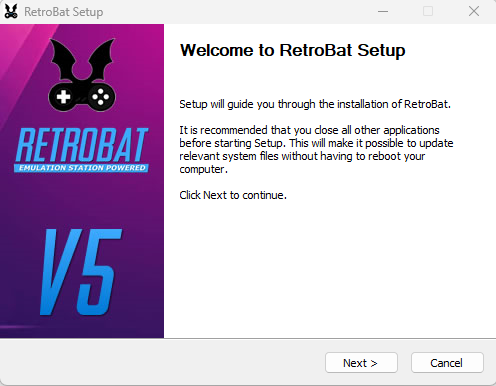
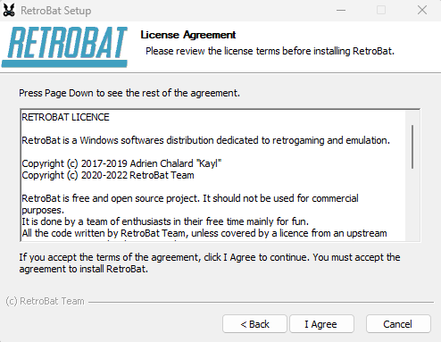
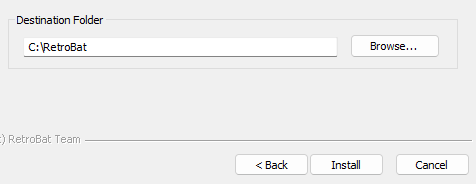
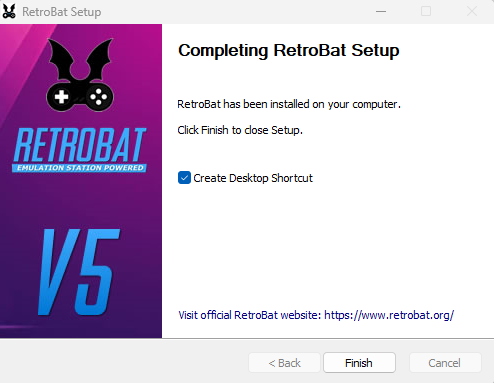
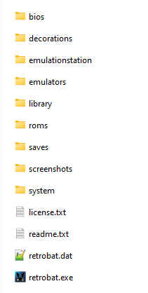
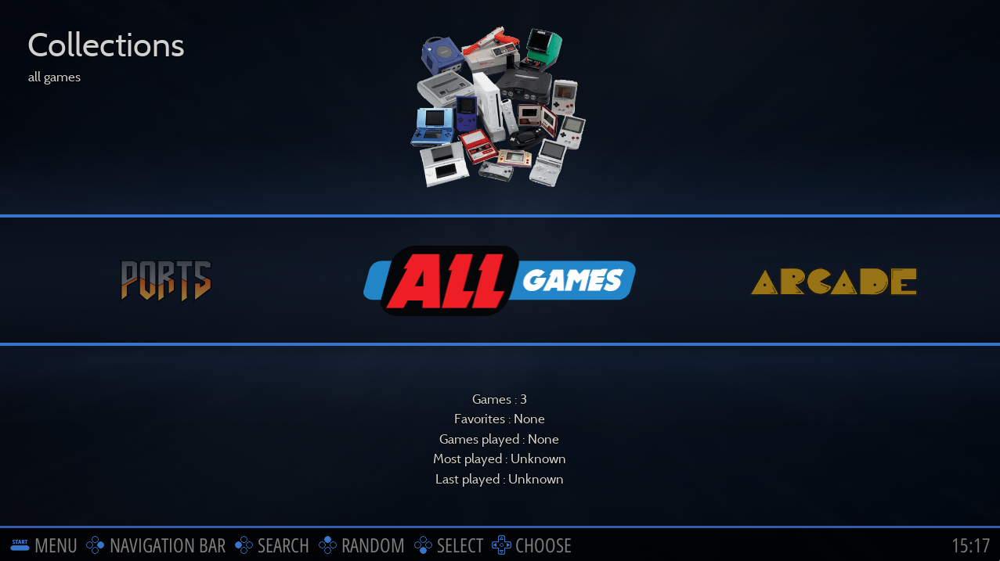
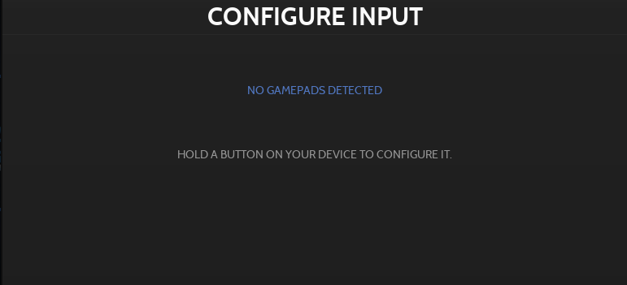
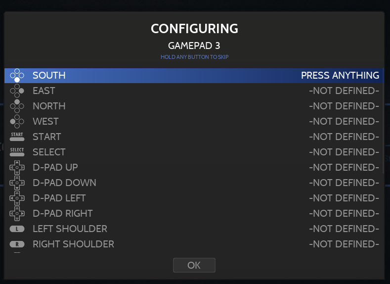

# Installation & First Startup(설치)

## 설 치
- [Retrobat 웹사이트](https://www.retrobat.org/download/)에서 최신 Retrobat 설정을 다운로드하세요.
- 설치를 실행하고 계속하려면 라이센스에 동의하세요.

- 대상 폴더를 찾아 설치를 선택합니다.

- 설치가 완료될 때까지 기다린 다음 바탕화면 바로가기를 생성하고 필요하지 않은 경우 확인란을 선택 취소한 다음 마침을 클릭합니다.

Setup 폴더 구조는 다음과 같습니다.

## 첫 시작
설치 폴더에서 retrobat.exe 파일을 두 번 클릭하거나 바탕 화면 바로 가기를 사용할 수 있습니다.
비디오 시작 화면 다음에 시스템 보기가 표시됩니다.

> 언어는 다를 수 있으며 RetroBat은 처음 시작할 때 OS 언어를 감지합니다.  
> 인식되는 언어 목록은 영어, 프랑스어, 일본어, 스페인어, 독일어, 이탈리아어, 네덜란드어, 포르투갈어, 러시아어, 한국어, 중국어, 폴란드어, 아랍입니다.

이 보기에서는 키보드나 게임 컨트롤러를 사용하여 탐색할 수 있습니다.

- 아무 버튼이나 누르면 CONFIGURE INPUT 화면이 나타납니다.

- 구성 화면으로 들어가려면 아무 버튼이나 길게 누릅니다.

- 컨트롤러 레이아웃을 기반으로 모든 키를 정의합니다.

> We recommend to use SELECT (or Back) as hotkey.

축하합니다: RetroBat을 설치하고 처음으로 성공적으로 시작했습니다.