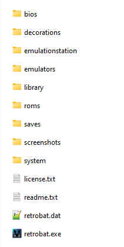

# RetroBat 폴더 구조

RetroBat이 설치되면 RetroBat 설치 폴더에는 다음 폴더가 포함됩니다.

## bios 폴더

이 폴더는 (몇 가지 예외를 제외하고) 모든 시스템 바이오스가 있는 곳입니다.

BIOS 파일에 대한 자세한 내용은 각 시스템의 [개별 페이지](https://wiki.retrobat.org/systems-and-emulators/supported-game-systems)에서 찾을 수 있습니다.

## emulators 폴더

에뮬레이터가 설치된 폴더입니다.

RetroBat을 설치할 때 기본적으로 Retroarch가 제공되며, 다른 모든 독립 실행형 에뮬레이터는 게임을 처음 실행하거나 RetroBat 메뉴에서 시작할 때 다운로드됩니다.

> 일부 에뮬레이터에는 RetroBat 자동 다운로드 기능이 자동으로 제공되지 않으므로 다음 에뮬레이터 목록은 수동으로 다운로드해야 합니다
> - Yuzu (& early-access)
> - Ryujinx
> - PICO-8
> - 3DSen
> - TeknoParrot

## library 폴더

이 폴더는 잡지를 저장하는 데 사용할 수 있으며 "라이브러리" 시스템의 RetroBat에 나타나며 Imageviewer libretro core를 사용하여 RetroBat 내에서 볼 수 있습니다.

## roms 폴더

게임 ROM을 복사해야 하는 폴더이며, 각 게임은 올바른 시스템 하위 폴더에 배치되어야 하며 에뮬레이터에서 허용하는 확장자가 있어야 합니다.

자세한 내용은 각 시스템의 [개별 페이지](https://wiki.retrobat.org/systems-and-emulators/supported-game-systems)에서 확인할 수 있습니다.

## saves 폴더

이 폴더에는 게임 진행 상황을 저장하기 위해 에뮬레이터에서 저장 기능을 사용할 때마다 게임 저장이 포함됩니다.

## screenshots 폴더

이 폴더에는 게임 플레이 중에 찍은 모든 스크린샷이 들어 있습니다.

> 저장 또는 스크린샷이 올바른 폴더에 기록되지 않은 경우 가능한 경우 RetroBat 팀에 문의하여 수정하세요.