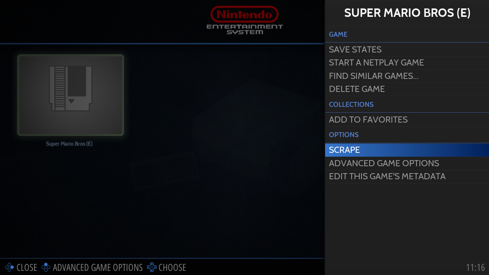

# Adding a game

게임을 추가하는 과정은 간단합니다.

## 롬 추가하기

게임 ROM은 \roms\<system>\ 폴더에 있어야 하며 Retrobat를 시작하거나 게임 목록을 업데이트할 때 감지되어 게임 Llibrary에 추가됩니다.

  
snes 롬 추가

> wiki의 [지원되는 게임 시스템 섹션](https://wiki.retrobat.org/systems-and-emulators/supported-game-systems)에서 시스템별 ROM 형식에 대한 자세한 정보를 확인하세요.

다시 시작하거나 게임 목록을 새로 고칠 때 시스템이 표시됩니다.

게임은 [게임 보기](https://wiki.retrobat.org/navigation/system-view-and-game-view#game-view)에서 볼 수 있습니다.

## 게임 정보 스크래핑

다음 단계는 게임 정보를 스크랩하는 것입니다. 게임 라이브러리는 미디어와 정보로 더 잘 보일 것입니다.

스크래핑은 시스템 또는 게임별로 전역적으로 수행할 수 있습니다.

## 글로벌 스크래핑

START(키보드의 ENTER)를 눌러 MAIN MENU를 표시하고 SCRAPER를 선택합니다.

  
스크레이퍼

SCRAPER SETTINGS를 구성하고 SCRAPE NOW를 선택합니다.

  
설정 및 스크랩 선택

> ScreenScraper의 경우 [Screenscraper](https://www.screenscraper.fr/) 웹사이트에서 계정을 만들어야 합니다.
> 그런 다음 SCRAPER SETTINGS 메뉴에 자격 증명(사용자/암호)을 입력합니다.
> [Scaping & 메타데이터](https://wiki.retrobat.org/navigation/scraping-and-metadata) 섹션에서 자세한 내용을 확인하세요.

화면 오른쪽 상단에 다음과 같은 메시지가 표시되며 스크래핑이 진행 중입니다.

  
스크래핑 진행 중

스크래핑이 완료되면 게임 목록을 새로 고칩니다.

START(키보드의 ENTER)를 눌러 [메인 메뉴](https://wiki.retrobat.org/navigation/main-menu)를 표시하고 GAME SETTINGS를 선택합니다.

**UPDATE GAMELIST**를 선택하세요.

게임 정보는 이제 [게임 보기](https://wiki.retrobat.org/navigation/system-view-and-game-view#game-view)에서 사용할 수 있습니다.

  
게임 정보가 데이터베이스에 추가되었습니다.

## 게임 당 스크래핑

단일 게임만 스크랩하려면 게임을 선택하고 를  길게 눌러 [게임 옵션](https://wiki.retrobat.org/navigation/game-options)을 엽니다.

**스크랩**을 선택합니다.

게임 보기에서 게임을 강조 표시하고 SOUTH 버튼을 길게 누릅니다.

가능한 매치 목록이 표시되면 적절한 게임을 선택하고  확인하세요.

> 기본 검색 문자열은 ROM 파일 이름을 기반으로 하며 검색 문자열을 변경하려면 하단의 **INPUT** 버튼을 사용하십시오.

  
올바른 게임을 선택하거나 INPUT을 눌러 게임 이름을 수동으로 입력하십시오.

축하합니다: Retrobat에 첫 번째 게임을 추가했습니다!