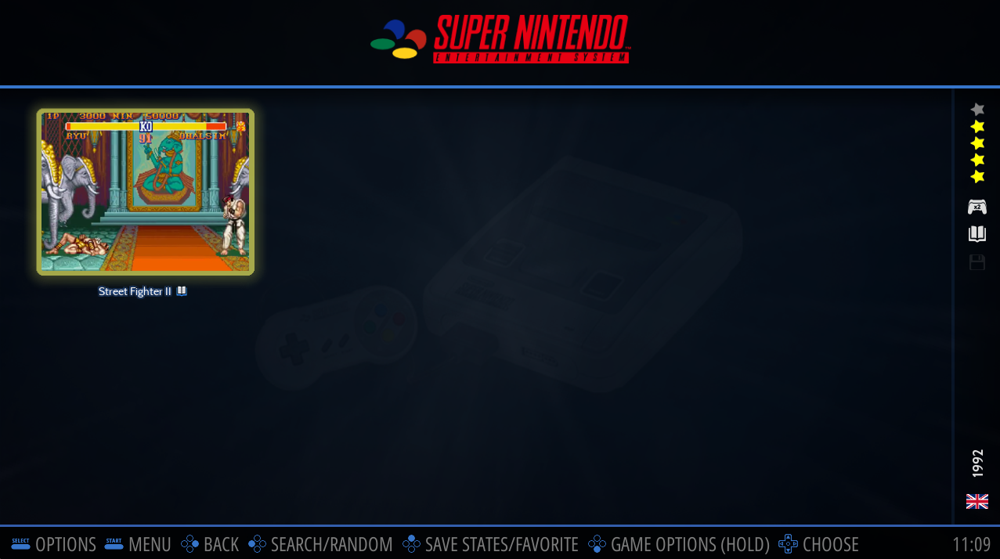
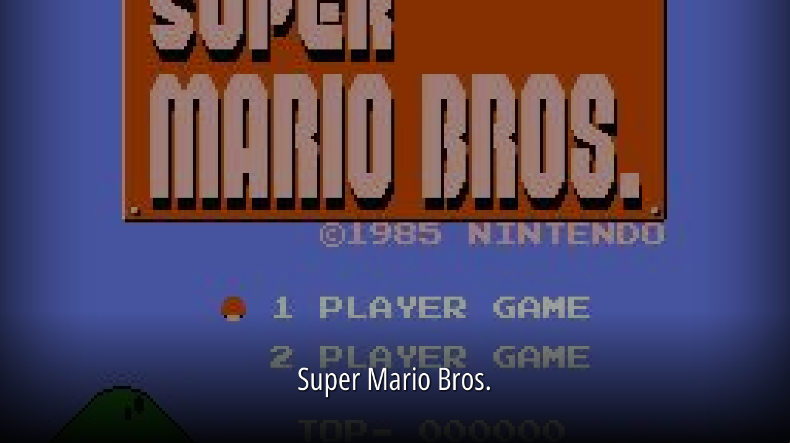
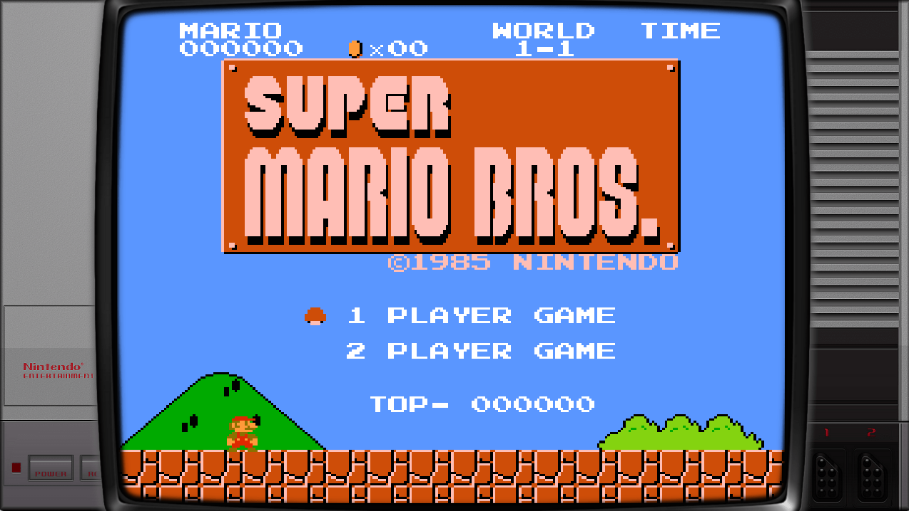
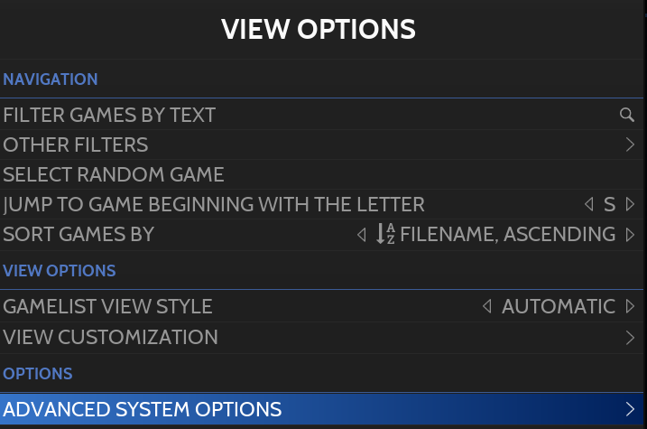
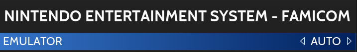
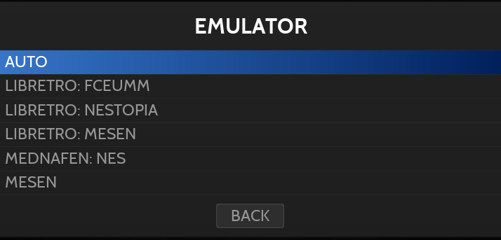
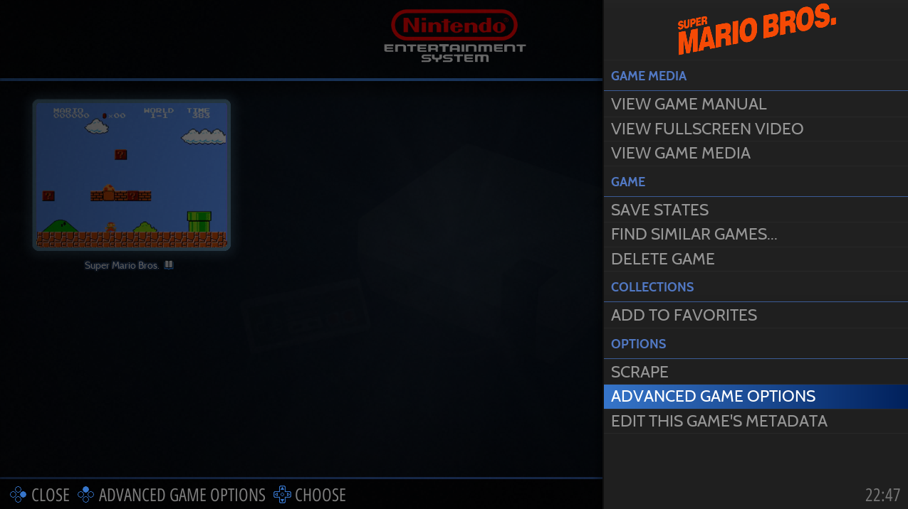
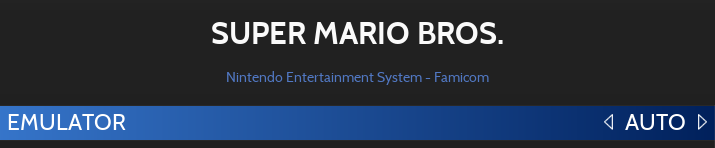

# Running a game

## 게임 선택 및 실행

게임을 실행하려면 [Game View](https://wiki.retrobat.org/navigation/system-view-and-game-view)에서  버튼을 누릅니다.

  
게임을 강조 표시하고 "SOUTH" 버튼을 누릅니다.

시작 화면이 나타나고 에뮬레이터가 게임을 시작합니다.

  
스플래시 화면

  
에뮬레이터 게임

게임 세션을 마치면 HOTKEY START를 눌러 에뮬레이터를 닫고 [게임 보기](https://wiki.retrobat.org/navigation/system-view-and-game-view#game-view)로 돌아갈 수 있습니다.

## Choosing the Emulator

일반적으로 Retrobat는 기본적으로 각 시스템에 가장 적합하고 안정적인 에뮬레이터를 사용합니다. 그러나 기본 에뮬레이터가 작동하지 않는 경우 전체 시스템 또는 특정 게임에 대한 에뮬레이터를 변경할 수 있습니다.

> 시스템별로 사용 ​​가능한 에뮬레이터의 전체 목록은 위키의 [지원되는 게임 시스템](https://wiki.retrobat.org/systems-and-emulators/supported-game-systems) 섹션에서 찾을 수 있습니다.

### Changing emulator for the System

게임 보기에서 **SELECT**를 누르고 **고급 시스템 옵션**으로 이동합니다.

**에뮬레이터**를 선택합니다.

목록에서 에뮬레이터를 선택합니다.

### Changing emulator for a game

[게임 보기](https://wiki.retrobat.org/navigation/system-view-and-game-view)에서 게임을 강조 표시하고  를 길게 눌러 **고급 게임 옵션**을 선택합니다.

목록에서 에뮬레이터를 선택합니다.

> **AUTO**는 시스템에 대해 지정된 경우 시스템 설정에서 선택한 에뮬레이터에 해당하거나 시스템도 **AUTO**로 설정된 경우 목록의 첫 번째 에뮬레이터에 해당합니다.