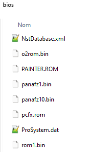
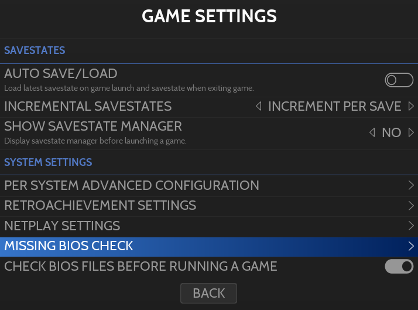
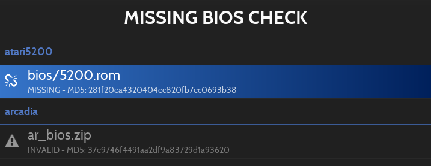

# Adding BIOS Files

BIOS 파일은 일부 에뮬레이터가 올바르게 작동하는 데 필요한 파일입니다.

## 위 치

대부분의 시스템에서 BIOS 파일은 Retrobat 설치의 \bios 폴더에 있어야 합니다.

> 일부 시스템에서는 BIOS 파일을 하위 폴더에 배치해야 합니다. BIOS 배치에 대한 자세한 내용은 개별 시스템 위키 페이지를 참조하세요.

## 누락된 BIOS 확인
[MAIN MENU](https://wiki.retrobat.org/navigation/main-menu)의 [GAME SETTINGS](https://wiki.retrobat.org/navigation/main-menu#game-settings)에서 누락된 BIOS를 확인할 수 있습니다.

누락된 BIOS는 끊어진 체인 아이콘과 함께 나타납니다. Retrobat에 의해 md5 해시가 나열되지 않은 해시는  아이콘과 함께 나타납니다.

> 각 시스템에 필요한 BIOS의 자세한 목록은 [위키의 개별 게임 시스템 섹션](https://wiki.retrobat.org/systems-and-emulators/supported-game-systems)에서 찾을 수 있습니다.

> BIOS 파일은 저작권이 있으므로 Retrobat에 포함되어 있지 않습니다. 합법적으로 배포할 수 없으므로 직접 제공해야 합니다.