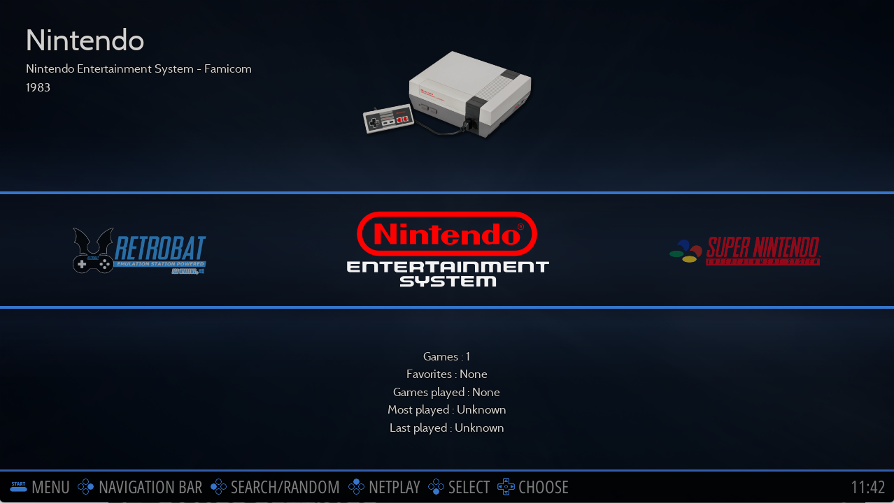

# System View and Game View

이 섹션의 모든 스크린샷은 기본 Retrobat 테마 **ES-THEME-CARBON**으로 수행됩니다.

## 시스템 보기

Retrobat를 시작할 때 표시되는 첫 번째 화면은 **시스템 보기**입니다. 여기에서 시스템을 탐색하고 **게임 보기**로 들어갈 수 있습니다.

  
<sup>ES-THEME-CARBON을 사용한 시스템 보기</sup>

> ROM이 roms 폴더에 있는 시스템만 나타납니다.

> 일부 시스템은 그룹화되어 있습니다. 자세한 내용은 [그룹화된 시스템](https://wiki.retrobat.org/navigation/system-view-and-game-view#grouped-systems) 섹션을 참조하십시오.

**시스템 보기**에서 다른 화면에 액세스할 수 있습니다.


## 빠른 검색
를 누르면 빠른 검색 메뉴가 표시됩니다. 그것은 당신이 게임을 검색할 수 있습니다.

  
<sup>빠른 검색을 통해 게임을 쉽게 찾을 수 있습니다.</sup>


## 네비게이션 바

를 누르면 탐색 표시줄이 표시됩니다.


이 메뉴를 사용하면 시스템 또는 컬렉션에 빠르게 액세스할 수 있으며 기본적으로 제조업체별로 정렬됩니다.


## 빠른 접근
**SELECT**를 누르면 빠른 액세스 메뉴가 표시됩니다.


이 메뉴에서 **USER MANUAL, SCREENSAVER, 노래 건너뛰기 및 종료** 옵션과 같은 기능에 액세스할 수 있습니다.


## 그룹화된 시스템

기본적으로 일부 시스템은 개별적으로 나타나지 않고 그룹으로 나타납니다.

<details>
  <summary>그룹화된 시스템 목록</summary>

  ```
    AMIGA
    * AMIGA 4000
    * AMIGA 1200
    * AMIGA 500

    GAME & WATCH
    * LCD Games

    MESS
    * Adventure Vision
    * TV Games
    * Mega Duck
    * PV-1000
    * CreatiVision
    * Game.com
    * Game Pocket Computer
    * Super Cassette Vision
    * FM-7
    * APF M-1000
    * BBC Micro
    * Arcadia 2001
    * Game Master
    * Astrocade
    * Tutor
    * TRS-80 Color Computer
    * Camputers Lynx
    * Super A'Can
    * Gamate

    MSX
    * MSX
    * MSX2
    * MSX2+

    PORTS
    * Ports
    * Cave Story
    * Easy-RPG
    * PrBoom
    * Quake
  ```
</details>


[메인 메뉴](https://wiki.retrobat.org/navigation/main-menu) > **게임 컬렉션 설정**에서 시스템 그룹을 해제할 수 있습니다.


**그룹 시스템**으로 이동:


그룹을 해제하려는 시스템을 선택 취소합니다:


이제 이러한 시스템은 시스템 보기에 개별적으로 나타납니다.


## 게임 보기
**게임 보기**는 게임을 검색하고 실행하는 곳입니다.

**Game View**로 들어가려면 **System View**에서 좌우 버튼을 이용하여 System 또는 Collection을 선택한 후  를 누르세요.

  
<sup>게임 목록 보기는 특정 시스템의 게임을 탐색하는 곳입니다.</sup>

방향성 패드를 사용하여 게임을 탐색하세요.
- 게임을 실행하려면 를 누릅니다(길게 누르면 [게임 옵션](https://wiki.retrobat.org/navigation/game-options)이 표시됨).
- **시스템 보기**로 돌아가려면 를 누릅니다.

게임 목록은 여러 가지 방법으로 표시할 수 있으며 이는 [VIEW OPTIONS](https://wiki.retrobat.org/navigation/view-options) (선택 누르기)에서 구성할 수 있습니다:


**AUTOMATIC** 값은 [MAIN MENU](https://wiki.retrobat.org/navigation/main-menu#user-interface-settings) > USER INTERFACE SETTINGS > THEME CONFIGURATION에 정의된 보기 스타일을 나타냅니다.

START를 누르세요.


> 테마마다 다른 게임 목록 보기 스타일이 있을 수 있습니다. 가장 마음에 드는 스타일을 선택하세요.