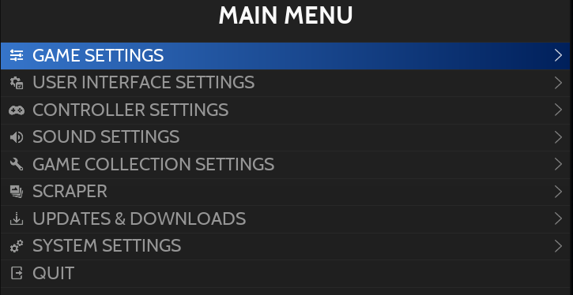

# Main Menu

**MAIN MENU**는 **START** (키보드의 **ENTER**)를 눌러 액세스합니다.

여기서 액세스 할 수 있습니다:
- Game Settings
- User Interface Settings
- Controller Settings
- Sound Settings
- Game Collection Settings
- Scraper
- Updates & Downloads
- System Settings

## Game Settings

| 섹션 | 설정 | 설명 |
|---|---|---|
| Tools | 게임 리스트 업데이트 | Retrobat는 추가된 ROM, 새로운 스크랩 미디어를 찾아 게임 목록을 새로 고칩니다... |
| Global Options | 쉐이더 셋 | 미리 정의된 셰이더 중에서 선택하여 시스템에 적용하세요. |
|  | 데코레이션 | 시스템의 기본 데코레이션을 선택하세요. |
|  | 비디오 모드 | Retrobat를 사용할 때 Windows 해상도 및 주사율을 정의합니다. |
|  | 게임 화면 비율 | |
|  | 정수 스케일링 | 호환 시스템에 대해 Pixel Perfect 에뮬레이션을 활성화하려면 선택합니다. |
|  | 스무스 | Bilinear Filtering을 전역적으로 적용하려면 선택합니다. |
|  | 컨트롤러 자동 구성 | 전역적으로 컨트롤러 자동 구성을 비활성화하려면 선택합니다. |
| Compression | 압축 해제 | 압축 ROM을 압축 해제한 후 시스템에서 압축 해제 폴더를 관리하는 방법을 정의합니다. |
| RetroArch Options | 비디오 | RetroArch 관련 비디오 매개변수 |
|  | 화면 싱크 | VSYNC와 같은 매개변수... |
|  | 오디오 | RetroArch와 관련된 오디오 매개변수 |
|  | 에뮬레이션 | 되감기 활성화 또는 비활성화 |
|  | 대기시간 감소 | 프레임 드랍을 줄이기 위한 몇 가지 설정 |
|  | AI 게임 번역 | 게임 번역 서비스 활성화 및 구성 |
|  | 사용자 인터페이스 | 사용자 인터페이스 설정(알림, 메뉴 요소 표시...) |
|  | 드라이버 | 비디오, 오디오 및 컨트롤러 드라이버 선택 |
| Savestates | 자동 저장/불러오기 | 게임 내 저장 데이터 자동 저장 및 불러오기 활성화 |
|  | 증분 저장 상태 | 자동 저장이 저장 파일을 관리하는 방법 구성 |
|  | 상태 저장 관리자 표시 | 게임 시작 전 Savestate Manager 표시 |
| System Settings | 시스템별 고급 구성 | 개별 시스템 설정 링크 (자세한 내용은 관련 위키 섹션 참조) |
|  | RetroAchievements 설정 | RetroAchievements 활성화 및 구성 |
|  | 넷플레이 설정 | 넷플레이 활성화 및 구성 |
|  | 누락된 BIOS 확인 | /bios/ 폴더에 누락된 BIOS 목록 표시 |
|  | 게임 시작전 BIOS 체크 | 게임 시작 시 BIOS 검사 활성화 / 비활성화 |
|||

## User Interface

| 섹션 | 설명 |
|---|---|
| Appearance | 테마를 선택하고 테마 구성을 선택합니다. |
| Display Options | 여러 디스플레이 옵션(전환, 시계 표시, 화면 보호기 설정 등) |
| Gamelist Options | 게임 목록 보기와 관련된 일반 설정(상단에 즐겨찾기, 아이콘, 게임 이름 대신 파일 이름...) |
|||

## Controller Settings

이 메뉴 항목은 새 컨트롤러를 구성하거나 컨트롤러를 재구성하는 데 사용됩니다.

화면 아이콘(배터리 수준, 컨트롤러 활동)을 활성화/비활성화하고 플레이어에게 기본 컨트롤러를 할당할 수도 있습니다.

## Sound Settings

이 메뉴 항목은 Retrobat 사운드를 관리하는 데 사용됩니다.:
- 음악 볼륨
- Retrobat 인터페이스에서 음악 활성화 및 구성
- 내비게이션 사운드 활성화

## Game Collection Settings

| 섹션 | 설명 |
|---|---|
| Collections to display | Retrobat에 표시할 시스템 및 게임 컬렉션 선택 |
| Create Custom Collection | Retrobat에 게임 컬렉션 추가 |
| Options | 여러 표시 옵션: 정렬, 숨겨진 시스템 표시... |
|||

> 게임 컬렉션에 대한 자세한 내용은 [전용 위키 섹션](https://wiki.retrobat.org/navigation/game-collections)에서 확인할 수 있습니다..

## Scraper

이 메뉴 항목은 Scrapers를 구성하고 게임 스크래핑을 시작하는 데 사용됩니다.

> 스크레이퍼에 대한 자세한 내용은 [전용 위키 섹션](https://wiki.retrobat.org/navigation/scraping-and-metadata)에서 확인할 수 있습니다.

## Updates & Downloads

이 메뉴 항목은:
- 무료 게임, 베젤, 테마와 같은 콘텐츠 다운로드
- Retrobat 업데이트

> Retrobat는 ROM을 제공하지 않으며 라이선스가 없고 무료로 사용할 수 있는 게임만 다운로드 섹션에서 사용할 수 있습니다.

## System Settings

| 섹션 | 설정 | 설명 |
|---|---|---|
| System | 정보 | 시스템 정보 표시 |
|  | 언어 | Retrobat 인터페이스 언어 선택 |
|  | 12시간 형식 시간 표시 | 시계 12시간/24시간 형식 선택 |
|  | 절전 모드 | 절전모드 선택 |
|  | 스크린 리더 | 텍스트 음성 변환 기능 켜기/끄기 |
|  | 사용자 인터페이스 모드 | Full, Kid, Kiosk 중 선택 |
| Advanced | 비디오 옵션 | VRAM 크기, 디스플레이 프레임 및 Vsync 옵션 |
|  | 도구 | 로그 활성화 등과 같은 개발자 도구 |
|  | 데이터 관리자 | |
|  | 사용자 인터페이스 | |
|  | 최적화 | |
|||