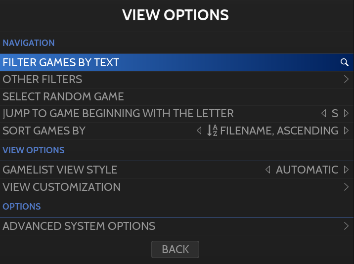

# View Options

**보기 옵션**은 **SELECT**를 누를 때 [게임 보기](https://wiki.retrobat.org/navigation/system-view-and-game-view#game-view)에서 액세스할 수 있습니다.

  
보기 옵션 메뉴

이 메뉴는 여러 옵션에 대한 액세스를 제공합니다.

## Navigation

- 게임 필터링 기능(텍스트 또는 기타 필터 기준)
- 시스템에서 임의의 게임 선택
- 지정된 문자로 시작하는 게임으로 이동
- 게임 정렬 변경

## View Options

- 보기 스타일 정의(사용된 테마에 따라 다름)
- 게임 목록 보기 사용자 지정
  - 게임리스트 스타일
  - 테마 옵션
  - 게임 목록 테마 옵션
  - 게임 목록 옵션(여기에는 시스템의 특정 파일 확장명을 숨길 수 있는 옵션이 있습니다)

## Advanced System Options

- 에뮬레이터 선택
- 일반 설정(쉐이더, 데코레이션, 종횡비, Vsync, 컨트롤러 자동 구성...)
- 고급 설정(Retrobat에 의해 에뮬레이터에 주입되는 코어/에뮬레이터별 특정 설정)