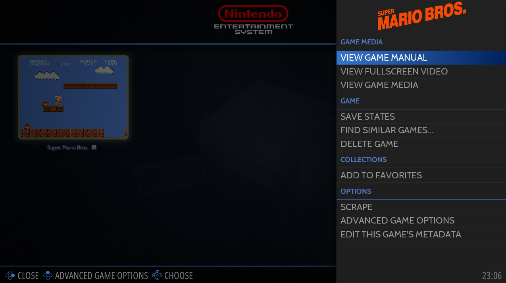

# Game Options

**게임 옵션 메뉴**는 게임이 강조 표시되었을 때 를 길게 눌러 **게임 보기**에서 액세스할 수 있습니다.

  
게임 옵션

이 메뉴에서 다음을 수행할 수 있습니다:

- 게임 매뉴얼, 비디오 및 미디어 보기
- 게임 관리(저장, 유사 게임 찾기, 게임 삭제)
- 즐겨찾기에 게임 추가
- 게임 스크랩 / 게임 메타데이터 편집
- 특정 게임 옵션 정의

## Advanced Game Options
시스템 수준에서 정의할 수 있는 것과 동일한 옵션을 게임 수준에서 정의할 수 있습니다.

**고급 게임 옵션**은 [시스템 설정](https://wiki.retrobat.org/navigation/view-options#advanced-system-options)과 다른 게임 설정을 정의해야 할 때 사용할 수 있습니다.