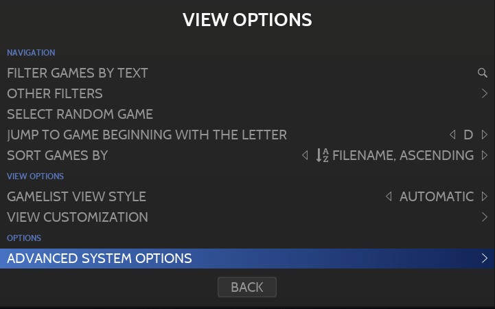

# Configuration of systems and games

다른 프런트 엔드 또는 독립 실행형 에뮬레이터에 비해 RetroBat을 사용하는 주요 이점은 모든 구성을 RetroBat 내에서 직접 관리할 수 있다는 것입니다.

즉, 사용자는 구성에 액세스하기 위해 에뮬레이터를 열 필요가 없습니다.

> RetroBat에서 설정한 기본값이 에뮬레이터로 전달되기 때문에 에뮬레이터 내에서 직접 구성을 관리하려고 하면 게임을 실행할 때 RetroBat에서 모든 구성을 덮어쓰는 경우가 많습니다.

RetroBat에서 사용할 수 있는 구성 요소를 "기능"이라고 하며 2단계로 설정할 수 있다는 장점이 있습니다:
- 시스템에 대해 전역적으로
- 게임당

## 구성 화면에 액세스하는 방법

기능 메뉴는 "[보기 옵션](https://wiki.retrobat.org/navigation/view-options)" 메뉴 또는 "[게임 옵션](https://wiki.retrobat.org/navigation/game-options)" 메뉴에서 사용할 수 있습니다:

ADVANCED SYSTEM OPTIONS 하위 메뉴를 선택할 때:

  
보기 옵션에서 기능에 액세스하는 방법

==> 이렇게 하면 선택한 시스템의 모든 게임에 대한 구성이 활성화됩니다.

고급 게임 옵션 하위 메뉴를 선택할 때

==> 이렇게 하면 지정된 게임에 대해서만 구성이 활성화됩니다.

더 자세한 옵션은 항상 에뮬레이터에 전달되는 옵션이라는 점에 유의하는 것이 매우 중요합니다. 즉, 특정 게임에 대한 옵션 세트가 시스템 수준에서 설정된 옵션보다 사용됩니다.

## 구성 옵션

사용 가능한 기능은 동일한 옵션이 없기 때문에 선택한 에뮬레이터에 따라 다릅니다.

이는 동일한 시스템에서 에뮬레이터를 변경할 때 사용 가능한 기능이 동일하지 않음을 의미합니다.

대부분의 경우 기능은 2개의 하위 그룹으로 그룹화됩니다:
- 일반 설정
- 고급 설정

  
FCEUMM 코어가 있는 NES의 설정 예

## General Settings

**일반 설정**은 다음 구성 옵션에 대한 액세스를 제공하며 대부분의 에뮬레이터에 존재합니다:

- 적용할 셰이더
- 적용할 베젤(장식)
- 게임 종횡비 및 해상도
- Vsync
- 완벽한 픽셀
- 컨트롤러 자동 구성 비활성화(이 옵션은 기본적으로 켜져 있음)

## Advanced Settings

이러한 기능은 훨씬 더 구체적이며 다음 하위 메뉴에 정리되어 있습니다:

- EMULATION : 언어, 기계 에뮬레이션, 지역과 같은 기능과 에뮬레이터에 사용할 수 있는 성능 옵션 포함
- VIDEO : 모니터 인덱스, 출력 신호, 화면 방향 등과 같은 일반 비디오 옵션...
- SCREEN SYNC : 일반적으로 고급 vsync 기능과 같은 찢어짐 방지 옵션 포함
- VISUAL RENDERING: 다양한 화면 효과 기능, 업스케일링 구성, 앤티앨리어싱 옵션...
- AUDIO : 샘플 속도, 저역 통과 필터와 같은 일반 오디오 설정...
- LATENCY REDUCTION : 입력 지연을 줄이기 위한 옵션
- USER INTERFACE : FPS 표시, 에뮬레이터 알림 활성화 / 비활성화 기능 포함
- DRIVERS : 에뮬레이터에서 사용하는 비디오, 오디오, 컨트롤러 드라이버 변경 옵션
- CONTROLS : 조이스틱 유형, 라이트건 옵션과 같은 컨트롤과 관련된 옵션...

  
FCEUMM 코어에 대한 EMULATION 기능 하위 메뉴의 예

또한 일부 에뮬레이터에는 특정 하위 메뉴가 있습니다. 예를 들어 MANUAL HACK 및 GAME FIXES 하위 메뉴가 있는 pcsx2 기능의 경우입니다:

또는 게임별 전용 설정이 있는 PORTS의 경우:

## 마술은 어떻게 작동하나요?

이 모든 것을 가능하게 하는 트릭은 간단합니다. 게임을 시작하기 전에 RetroBat은 사용자가 설정한 옵션을 검토하고 에뮬레이터를 실행하기 전에 에뮬레이터 구성 파일에 이러한 설정을 직접 적용합니다.

예를 들어 duckstation 에뮬레이터의 비디오 드라이버를 VULKAN으로 변경해야 하는 사용자의 경우를 살펴보겠습니다.

시스템 구성 옵션 화면에서 한 번

**ADVANCED SETTINGS** 그룹에서 **DRIVERS** 하위 메뉴를 선택합니다:

그런 다음 VIDEO DRIVER 옵션을 "VULKAN"으로 변경합니다:

duckstation 에뮬레이터로 게임을 실행할 때 RetroBat은 이제 게임을 시작하기 전에 Duckstation 설정 파일에서 다음 값을 자동으로 설정합니다:

짜잔!

## 훌륭하지만 "AUTO" 값은 무엇을 의미합니까?

"AUTO" 값은 시스템 수준에서 기능을 구성하는지 게임 수준에서 기능을 구성하는지에 따라 의미가 다릅니다.

시스템 수준에서 "AUTO" 값은 RetroBat이 대상 옵션 값으로 설정하는 기본값이며 RetroBat 팀은 일반적으로 가장 일반적으로 사용되는 값을 기본값 또는 최상의 사용자 경험과 가장 관련성이 높은 값으로 정의했습니다.

게임 수준 구성에서 값 "AUTO"는 시스템/에뮬레이터에 설정된 기본값을 사용해야 함을 의미합니다.

> "게임별" 설정이 일반 설정보다 우선합니다.

## 좋습니다. 하지만 설정해야 하는 옵션이 보이지 않습니다!

에뮬레이터 내에 변경하려는 옵션이 있는 경우 당황하지 말고 다음 릴리스에 이 옵션을 포함할 RetroBat 팀에 주저하지 말고 연락하십시오!

그동안 RetroBat에서 사용할 수 없는 옵션은 에뮬레이터에서 직접 변경할 수 있으며 일반적으로 RetroBat에서 덮어쓰지 않습니다...