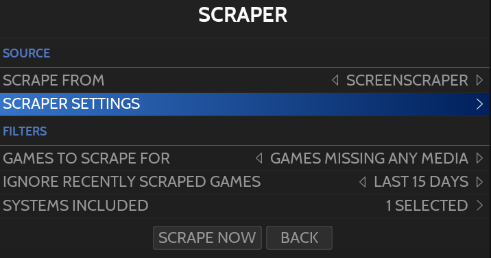

# Scrapping & Metadata

스크래핑은 컬렉션의 게임에 대한 메타데이터 및 미디어 파일(이미지, 비디오, 맵, 패드-키 설정 및 설명서)을 다운로드하는 데 사용됩니다.

Retrobat는 4가지 스크래핑 서비스를 지원합니다:
- ScreenScraper(기본 서비스) : 자격 증명이 필요 ([스크린스크래퍼 웹사이트](https://www.screenscraper.fr/))
- [TheGamesDB](https://thegamesdb.net/)
- [HFSDB](https://db.hfsplay.fr/)
- ArcadeDB

## 스크랩 가능한 정보
- 게임 정보(제목, 연도, 플레이어 수, 설명...)
- 등급(점수)
- 썸네일(상자)
- 선택 윤곽 / 휠
- 동영상
- 팬 아트
- 이미지(타이틀 화면 또는 인게임 스크린샷)
- 박스 뒷면
- 지도
- 매뉴얼
- Pad-to-key 설정

## 스크래핑 과정
스크래핑에는 [게임 옵션](https://wiki.retrobat.org/navigation/game-options)의 단일 게임 또는 [메인 메뉴](https://wiki.retrobat.org/navigation/main-menu)의 여러 게임 및 시스템(글로벌 스크래핑)의 두 가지 접근 방식이 있습니다.

글로벌 스크래핑  
지침은 [위키의 다음 부분을 참조](https://wiki.retrobat.org/get-started/adding-a-game#global-scraping)하세요.

게임당 스크래핑  
지침은 [위키의 다음 섹션을 참조](https://wiki.retrobat.org/get-started/adding-a-game#per-game-scraping)하세요.

## 스크래핑 옵션

스크래핑 옵션은 [메인 메뉴](https://wiki.retrobat.org/navigation/main-menu)에서 사용할 수 있습니다.

스크래퍼를 실행하기 전에 다음을 수행할 수 있습니다.:
- 사용할 스크래퍼 선택
- 스크래퍼를 모든 미디어가 누락된 게임 또는 미디어가 누락된 게임으로만 제한
- 최근에 스크랩한 게임 무시
- 시스템 포함/제외

또한 각 스크레이퍼에는 자체 설정이 있습니다:

  
ScreenScraper에 사용 가능한 설정의 예

여기에서 스크랩할 데이터를 선택할 수 있을 뿐만 아니라 정의할 수도 있습니다:
- "image" 파일로 사용할 이미지
- "thumb" 이미지로 사용할 이미지
- 로고로 사용할 이미지(marquee 또는 wheel)

> Scraper 설정 화면은 ScreenScaper 서비스에 대한 자격 증명을 입력할 수 있는 곳이기도 합니다.

## 스크랩한 미디어 보관

모든 스크랩 미디어는 ROM 폴더에 저장됩니다.

  
미디어 폴더의 예

| 폴더 | 미디어 스토어 |
|---|---|
| images | 박스 (썸네일), 팬아트, 박스 뒷면, 이미지, 외곽, 맵 |
| manuals | pdf 메뉴얼 |
| videos | mp4 동영상 |
|||

## 로컬 미디어 사용

컴퓨터에 이미 저장되어 있는 기존 이미지와 비디오 또는 직접 만든 미디어를 사용하도록 결정할 수도 있습니다.

다음을 수행해야 합니다:

- 게임 파일과 정확히 같은 미디어 파일의 이름을 바꾸고,
- 미디어 유형에 특정한 이름 확장자를 추가하세요:
  - **썸네일** 박스 아트 이미지의 경우 name_of_game-thumb,
  - 게임 이미지의 **이미지** name_of_game-image,
  - 게임 로고 이미지에 대한 **외곽** name_of_game-marquee,
  - 게임 비디오의 **video.mp4** name_of_game-video.mp4.
- 이미지는 "**images**" 폴더에, 비디오는 "**videos**" 폴더에 미디어 파일을 넣습니다.
- [시스템 설정](https://wiki.retrobat.org/navigation/main-menu#system-settings)의 "**프론트엔드 개발자 옵션**"에서 "**로컬 아트 검색**"을 활성화합니다.

## 게임 메타데이터 수동 수정

[게임 옵션](https://wiki.retrobat.org/navigation/game-options) 메뉴는 게임에 대한 메타데이터를 수동으로 편집/완성할 수 있는 가능성을 제공합니다.

## 당신은 할 수 있습니다:

- 게임 정보 업데이트(이름, 설명, 등급, 출시일, 개발자, 퍼블리셔, 제품군, 장르, 아케이드 시스템, 플레이어 수, 언어 및 지역)
- 다른 미디어 파일 첨부
- 즐겨찾기에 게임 추가
- 게임 숨기기
- 게임을 KID 게임으로 플래그 지정하여 키드 모드에서 표시