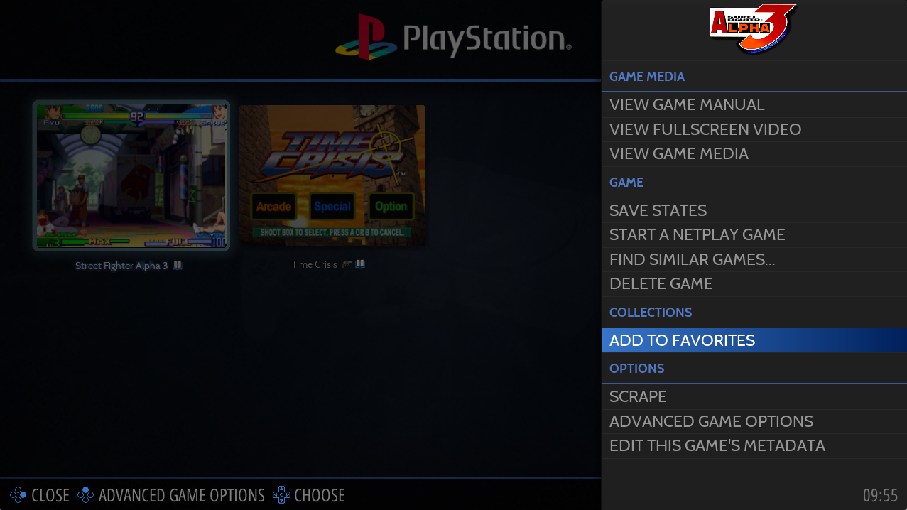
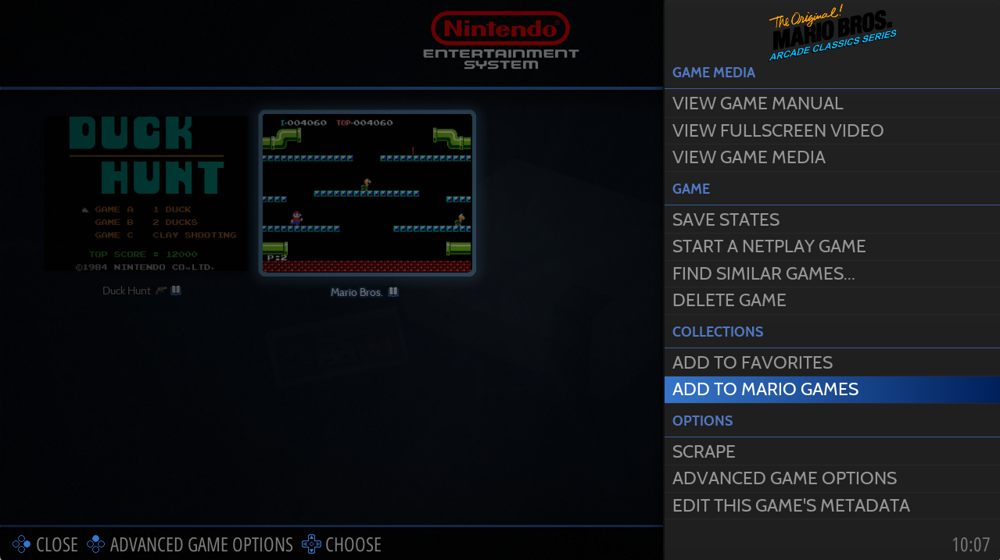
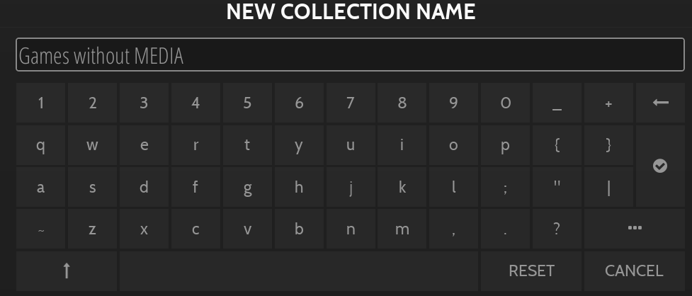

# Game Collections

게임 컬렉션은 기본 "시스템별" 구성과 다른 방식으로 라이브러리를 정렬하는 강력한 방법입니다.

모음이 생성되면 시스템 목록 사이의 [시스템 보기](https://wiki.retrobat.org/navigation/system-view-and-game-view)에 나타납니다.

게임 컬렉션 설정 화면은 메인 메뉴에서 사용할 수 있습니다.


Retrobat는 활성화할 수 있는 **자동 게임 컬렉션**과 함께 번들로 제공됩니다.
자신만의 게임 컬렉션을 만들 수도 있습니다.

이를 위한 두 가지 옵션이 있습니다:
- 편집 가능한 컬렉션
- 다이나믹한 컬렉션


## 자동 게임 컬렉션

게임 컬렉션 설정 화면에서 **자동 게임 컬렉션**을 선택합니다.


컬렉션 목록을 사용할 수 있습니다. 컬렉션 상자를 선택하여 컬렉션을 활성화하십시오..

예를 들어 아케이드 컬렉션을 표시하려면 **ARCADE**를 선택합니다.


이렇게 하면 ARCADE 시스템으로 식별된 모든 시스템의 게임이 포함된 Arcade 컬렉션을 System View에서 사용할 수 있습니다.


자동 컬렉션에는 3가지 범주가 있습니다:
 - 자동 컬렉션(표준)
 - 장르별 컬렉션
 - 아케이드 시스템 컬렉션

자동 컬렉션

다음과 같은 자체 설명이 포함된 컬렉션 목록을 사용할 수 있습니다.

<details>
  <summary>표준 컬렉션</summary>

  ```
  ALL GAMES
  LAST PLAYED
  FAVORITES
  2 PLAYERS
  4 PLAYERS
  NEVER PLAYED
  RETROACHIEVEMENTS
  ARCADE
  VERTICAL GAMES
  LIGHTGUN GAMES
  ```
</details>


## Favorites

FAVORITE 컬렉션의 경우 좋아하는 게임에 플래그를 지정해야 합니다. 이 작업은 **게임 옵션** 메뉴에서 수행할 수 있습니다.



> 게임 보기에서 게임을 강조 표시하고  를 길게 눌러 즐겨찾기 목록에 게임을 추가할 수도 있습니다.

또한 좋아하는 게임은 [게임 보기](https://wiki.retrobat.org/navigation/system-view-and-game-view)의 목록 맨 위에 표시될 수도 있습니다.

그렇게 하려면 [보기 옵션](https://wiki.retrobat.org/navigation/view-options) 메뉴에서 **사용자 정의 보기 옵션**을 선택하세요.


[보기 옵션](https://wiki.retrobat.org/navigation/view-options)에서 **SHOW FAVORITES ON TOP**을 활성화합니다.


## 편집 가능한 게임 컬렉션

편집 가능한 게임 컬렉션은 컬렉션을 수동으로 관리할 수 있도록 설계되었으며, 편집 가능한 컬렉션에 게임을 추가하는 유일한 방법은 아래와 같이 수동으로 추가하는 것입니다.

GAME COLLECTION SETTINGS 화면에서 **CREATE NEW EDITABLE COLLECTION**을 선택합니다.


컬렉션의 이름을 정의하고 유효성을 검사합니다.

  
<sup>마리오 게임 컬렉션 만들기</sup>

이것이 생성하는 첫 번째 모음인 경우 [시스템 보기](https://wiki.retrobat.org/navigation/system-view-and-game-view)에서 새 **COLLECTIONS** 항목을 사용할 수 있게 됩니다.

  
<sup>새 컬렉션 폴더</sup>

**COLLECTIONS** 항목에는 방금 생성된 컬렉션을 포함하여 컬렉션 목록이 포함되어 있습니다.

  
<sup>Collections 폴더에 Mario Games 컬렉션이 나타납니다.</sup>

다음 단계는 새로 만든 컬렉션에 게임을 추가하는 것입니다. 이렇게 하려면 [게임 보기](https://wiki.retrobat.org/navigation/system-view-and-game-view)에서 게임을 강조 표시하고 를 길게 눌러 [게임 옵션](https://wiki.retrobat.org/navigation/game-options) 메뉴를 표시하고 **컬렉션** 부분에서 게임을 추가해야 하는 컬렉션을 선택합니다.

  
<sup>Mario Games 컬렉션에 MARIOS BROS 추가</sup>

이제 게임이 컬렉션에 추가되고 컬렉션 게임 보기에 나타납니다.


## 다이나믹 게임 컬렉션

동적 게임 컬렉션은 여러 기준 및 필터를 기반으로 컬렉션에 게임을 자동으로 추가하는 보다 강력한 도구를 제공합니다. 컬렉션을 표시할 때 시스템은 필터에 정의된 기준을 충족하는 모든 게임을 자동으로 표시합니다.

GAME COLLECTION SETTINGS 화면에서 **CREATE NEW DYNAMIC COLLECTION**을 선택합니다.


컬렉션의 이름을 정의하고 유효성을 검사합니다.



동적 컬렉션을 사용자 지정하기 위한 필터링 옵션 목록이 나타납니다.


컬렉션에 적용할 필터(예: HAS MEDIAS = NO)를 선택하고 BACK으로 이동합니다.


선택한 필터로 새 컬렉션이 생성되었습니다.

