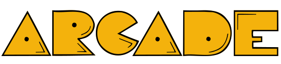
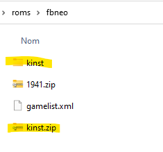

# Arcade Guide

## 소개글
아케이드 에뮬레이터는 2가지 범주로 나눌 수 있습니다:
- 멀티 아케이드 머신 에뮬레이터
- 단일 아케이드 보드 에뮬레이터

매우 다양한 아케이드 머신이 있으며 이것이 바로 아케이드 에뮬레이션이 복잡한 이유입니다.

이 가이드에서는 2가지 에뮬레이터 제품군에 초점을 맞추고 아케이드 에뮬레이션을 이해하는 주요 키를 제공하며 위에서 설명한 2가지 제품군의 에뮬레이터를 그룹화합니다.

## 멀티 머신 에뮬레이터

사용 가능한 다중 시스템 아케이드 에뮬레이터에는 FinalBurn 및 MAME의 두 가지 제품군이 있습니다.

이러한 에뮬레이터는 사용자가 자신의 게임과 코어/에뮬레이터를 가장 잘 일치시킬 수 있도록 여러 버전으로 제공됩니다.

### Retrobat에서 사용 가능한 Multi-Machine Arcade 에뮬레이터

| 에뮬레이터/코어 | 롬 폴더 | 롬 셋 버전 |
|---|---|---|
| libretro: mame (current) | `\roms\mame` | 0.251 |
| libretro: mame2016 | `\roms\mame` | 0.174 |
| libretro: mame2014 | `\roms\mame` | 0.159 |
| libretro: mame2010 | `\roms\mame` | 0.139 |
| libretro: mame2003_plus | `\roms\mame` | 0.78plus |
| libretro: mame2003 | `\roms\mame` | 0.78 |
| libretro: mame2000 | `\roms\mame` | 0.37b5 |
| mame (standalone) | `\roms\mame` | 0.253 |
| Libretro: fbneo | `\roms\fbneo` | 1.0.0.3 |
| Libretro: fbalpha | `\roms\fbneo` | 0.2.97.44 |
| Libretro: fbalpha2012 | `\roms\fbneo` | 0.2.97.29 |
|||

MAME는 일반적인 아케이드 게임(Pac-Man, Asteroids 등)에 사용되는 일반적인 에뮬레이터입니다.

FBNeo는 격투 게임과 Beat-them-up에 특화되어 있습니다.

## 단일 보드 에뮬레이터

| 아케이드 머신(s) | 롬 폴더 | 에뮬레이터 |
|---|---|---|
| FMV LaserDisc Arcade Games | `\roms\daphne` | DAPHNE / Hypseus |
| ATOMISWAVE | `\roms\atomiswave` | FLYCAST / Demul |
| GAELCO | `\roms\gaelco` | Demul |
| SEGA MODEL 2 | `\roms\model2` | m2emulator |
| SEGA MODEL 3 | `\roms\model3` | Supermodel |
| SEGA NAOMI | `\roms\naomi` | FLYCAST / Demul |
| SEGA NAOMI 2 | `\roms\naomi2` | FLYCAST / Demul |
| HIKARU | `\roms\hikaru` | Demul |
| TRIFORCE | `\roms\triforce` | DOLPHIN |
| CHIHIRO | `\roms\chihiro` | CXBX-RELOADED |
| PC-BASED ARCADE | `\roms\teknoparrot` | TEKNOPARROT |
|||

## 롬

### 용어
- **ROM, ROM set, and romset**: 아케이드 게임은 zip 파일로 패키징되며 대부분은 하나 이상의 개별 'ROM' 파일로 구성됩니다.
그렇기 때문에 일부 리소스는 개별 아케이드 게임을 ROM으로 참조하고 다른 리소스는 개별 게임을 ROM 세트 또는 롬셋으로 참조합니다.

- **ROM version or romset version**: 아케이드 에뮬레이터의 각 버전은 정확한 버전 번호가 동일한 ROM과 함께 사용해야 합니다.
예를 들어 MAME 0.37b5 ROM은 MAME 2000 에뮬레이터에 필요하지만 MAME 0.139 ROM이 필요한 MAME 2010 에뮬레이터에서는 제대로 작동하지 않습니다.

### ROM 세트 유형

아케이드 ROM은 네 가지 방식으로 포맷할 수 있습니다:

- **전체 비병합**: 각 zip에는 '부모' ROM 세트 및 BIOS 세트의 ROM을 포함하여 해당 게임을 실행하는 데 필요한 모든 파일이 포함되어 있기 때문에 모든 romset을 독립형으로 사용할 수 있습니다.

- **병합되지 않은 ROM**: 각 zip에는 '부모 romset'의 모든 파일을 포함하여 해당 게임을 실행하는 데 필요한 모든 파일이 포함되어 있기 때문에 모든 romset을 독립형으로 사용할 수 있습니다.
유일한 예외는 'Split'으로 포맷된 BIOS ROM을 사용하는 게임이며 이를 사용하는 게임 ROMset과 동일한 폴더에 보관해야 합니다.

- **분 리**: 클론, 번역 또는 해적판으로 간주되는 일부 롬셋도 실행하려면 "부모" 롬셋이 필요합니다. 그러나 경우에 따라 상위 버전이 가장 인기 있거나 가장 잘 작동하는 게임 버전이 아닙니다.
예를 들어 분할 세트 pacman.zip(클론)에서 puckman.zip(부모)이 없으면 작동하지 않습니다.

- **합 병**: 클론은 상위 romset zip으로 병합됩니다. 즉, 파일당 하나 이상의 게임이 저장됩니다.

> 병합된 ROM 세트는 지원되지 않습니다. RetroBat에서는 기본 게임만 표시되고 Mame 코어에서 실행되기 때문입니다.
> 병합되지 않은 롬 세트를 사용하는 것이 좋습니다.

> 압축된 ROM 파일의 이름을 바꾸지 마십시오. 스크레이퍼는 .zip 파일 이름으로 게임을 인식하고 올바른 게임과 일치시킵니다.

## 추가 파일

### 견 본

일부 게임은 작동하려면 추가 샘플 파일이 필요하며 다음 폴더에 배치해야 합니다:

- fbneo: \bios\fbneo\samples
- mame2003: \bios\mame2003\samples
- mame2003plus: \bios\mame2003-plus\samples
- mame2010: \bios\mame2010\samples
- 현재 mame 및 독립 실행형 mame: \bios\mame\samples

### CHD 또는 IMG 파일

일부 아케이드 게임은 CHD(경우에 따라 IMG)라는 추가 파일(원래 디스크에 물리적으로 저장됨)을 사용할 수 있습니다.

CHD 폴더는 ROM 폴더에 있어야 하며 게임의 ZIP 파일과 이름이 같아야 합니다.

예를 들어 kinst.zip의 경우 게임은 kinst\kinst.chd를 찾습니다.

## 링크 및 참조
> **Credits**  
> 이 페이지의 많은 정보는 libretro 문서에서 가져왔습니다:  
[https://docs.libretro.com/guides/arcade-getting-started/](https://docs.libretro.com/guides/arcade-getting-started/)