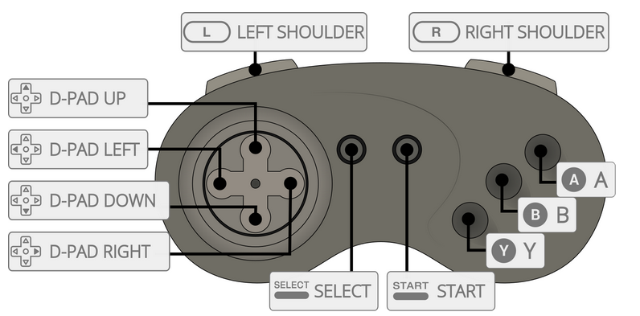

# 3DO

게임 콘솔 - 수명: 1993 - 1999

정보

|||
|---|---|
| 에뮬레이터 | Libretro: 4do |
|  | Libretro: opera |
|  | phoenix |
| 파일 폴더 | roms \ 3do |
| 파일 확장자 | .cue .iso .chd .m3u |
|||

## 바이오스 정보

| 바이오스 파일 | 폴더 | md5 |
|---|---|---|
| panafz1.bin | `\bios` | f47264dd47fe30f73ab3c010015c155b |
| panafz10.bin | `\bios` | 51f2f43ae2f3508a14d9f56597e2d3ce |
| goldstar.bin | `\bios` | 8639fd5e549bd6238cfee79e3e749114 |

## 컨트롤러

| Retrobat 버튼 | 3do 키 |
|---|---|
| START | START |
| SELECT | SELECT |
| D-PAD | D-PAD |
| 왼쪽 아날로그 스틱 | D-PAD |
| 오른쪽 아날로그 스틱 |  |
|  | A |
|  | B |
|  | C |
|  |  |
| L1 | L1 |
| R1 | R1 |
| L2 |  |
| R2 |  |
| L3 |  |
| R3 |  |
|||

## 특정 시스템 정보

아직 여기에 문서화된 특정 시스템 정보가 없습니다.