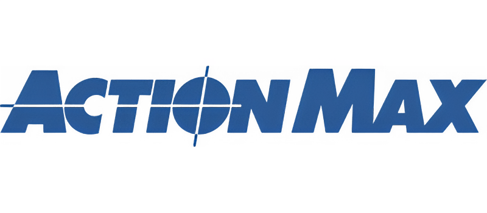
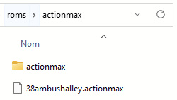

# Actionmax



게임 콘솔 - 출시일: 1987

## 정 보

|||
|---|---|
| 에뮬레이터 | hypseus |
| 게임 위치 | roms \ actionmax |
| 파일 확장자 | .actionmax |
|||

## 시스템 기능

| Retroachievements | 넷플레이 |
|---|---|
| No | No |
|||


## 바이오스

BIOS가 필요하지 않습니다.


## 컨트롤

TBD


## 특정 시스템 정보

### Actionmax 게임 추가

ActionMax 게임은 Hypseus 에뮬레이터와 호환되지만 매우 특정한 폴더 구조가 필요합니다.

모든 Actionmax 게임은 다음 콘텐츠가 있는 roms\actionmax\actionmax 폴더 안에 있어야 합니다:

```
+---38ambushalley
|       video_38ambushalley.dat
|       video_38ambushalley.m2v
|       video_38ambushalley.ogg
|       
+---bluethunder
|       video_bluethunder.m2v
|       video_bluethunder.ogg
|       
+---hydrosub2021
|       video_hydrosub2021.m2v
|       video_hydrosub2021.ogg
|       
+---popsghostly
|       video_popsghostly.m2v
|       video_popsghostly.ogg
|       
+---sonicfury
        video_sonicfury.m2v
        video_sonicfury.ogg
|
|   38ambushalley.singe
|   38ambushalley.txt
|   bluethunder.singe
|   bluethunder.txt
|   emulator.singe
|   font_bluestone.ttf
|   font_chemrea.ttf
|   font_led_real.ttf
|   framework.singe
|   hydrosub2021.singe
|   hydrosub2021.txt
|   popsghostly.singe
|   popsghostly.txt
|   sonicfury.singe
|   sonicfury.txt
|   sound_actionmax.wav
|   sound_asteadyaimiscritical.wav
|   sound_badhit.wav
|   sound_gameover.wav
|   sound_getreadyforaction.wav
|   sound_goodhit.wav
|   sound_gunshot.wav
|   sprite_38ambushalley.png
|   sprite_actionmax.png
|   sprite_actionmax_orig.png
|   sprite_bluethunder.png
|   sprite_bullet.png
|   sprite_crosshair.png
|   sprite_hydrosub2021.png
|   sprite_lightoff.png
|   sprite_lighton.png
|   sprite_popsghostly.png
|   sprite_sonicfury.png
|   video_actionmaxintro.dat
|   video_actionmaxintro.m2v
|   video_actionmaxintro.ogg
|   video_menu.dat
|   video_menu.m2v
|   video_menu.ogg
```

빈 파일을 만들고 게임 이름과 roms\actionmax 폴더의 확장자 .actionmax로 이름을 지정합니다(예: 38ambushalley.actionmax).

