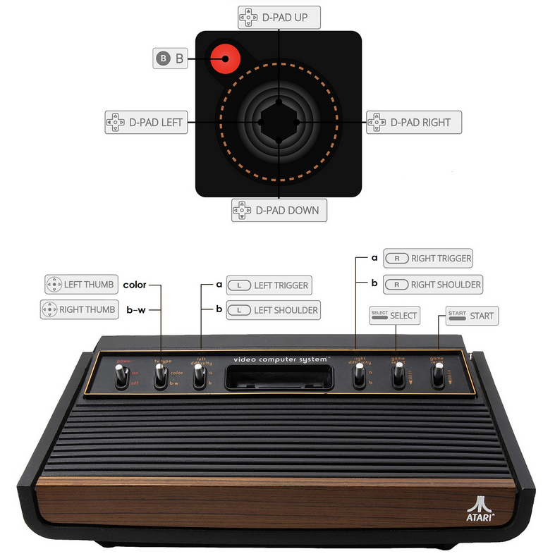

# Atari 2600

게임 콘솔 - 수명: 1977 - 1992

## 정 보

|||
|---|---|
| 에뮬레이터 | libretro: stella |
|  | libretro: stella2014 |
| 게임 경로 | roms \ atari2600 |
| 파일 확장자 | .7z .a26 .bin .gz .rom .zip |
|||

## 바이오스

ATARI 2600에는 BIOS가 필요하지 않습니다.

## 컨트롤

| Retrobat 버튼 | Atari 2600 키 |
|---|---|
| START | Game reset (on console) |
| SELECT | Game select (on console) |
| D-PAD | Joystick 이동 |
| 왼쪽 아날로그 스틱 |  |
| 오른쪽 아날로그 스틱 |  |
|  |  |
|  | Joystick 버튼 |
|  |  |
|  |  |
| L1 | 왼쪽 난이도 b(콘솔) |
| R1 | 오른쪽 난이도 b(콘솔) |
| L2 | 왼쪽 난이도 a(콘솔) |
| R2 | 오른쪽 난이도 a(콘솔) |
| L3 | 색상(콘솔) |
| R3 | 검정 & 흰색(콘솔) |
|||

## 특정 시스템 정보

아직 여기에 문서화된 특정 시스템 정보가 없습니다.