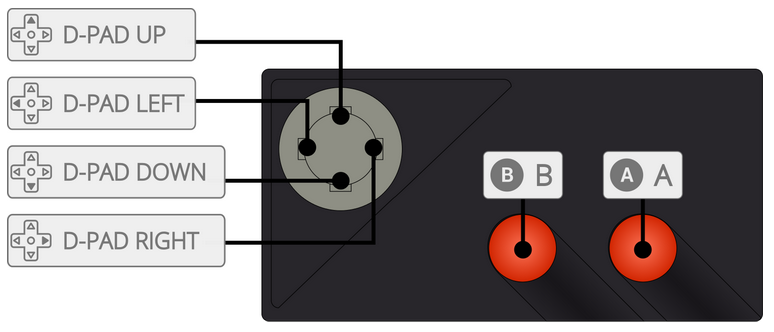

# Atari 7800

게임 콘솔 - 수명: 1986 - 1992

## 정 보

|||
|---|---|
| 에뮬레이터 | libretro: prosystem |
| 게임 경로 | roms \ atari7800 |
| 파일 확장자 | .a78 .bin .zip .7z |
|||

## 바이오스

| 바이오스 파일 | 폴더 | md5 |
|---|---|---|
| 7800 BIOS (E).rom | `\bios` | 397bb566584be7b9764e7a68974c4263 |
| 7800 BIOS (U).rom | `\bios` | 0763f1ffb006ddbe32e52d497ee848ae |
| ProSystem.dat | `\bios` | ce6a86574d0c9de9075705f14e99d090 |
|||

## 컨트롤

| Retrobat 버튼 | Atari 7800 키 |
|---|---|
| START |  |
| SELECT |  |
| D-PAD | D-PAD |
| 왼쪽 아날로그 스틱 |  |
| 오른쪽 아날로그 스틱 |  |
|  |  |
|  |  |
|  |  |
|  |  |
| L1 |  |
| R1 |  |
| L2 |  |
| R2 |  |
| L3 |  |
| R3 |  |
|||

## 특정 시스템 정보

아직 여기에 문서화된 특정 시스템 정보가 없습니다.