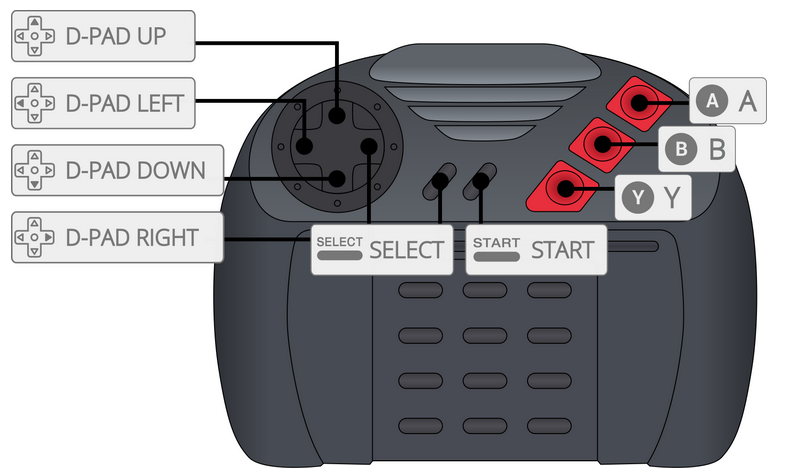

# Jaguar

게임 콘솔 - 수명: 1993 - 1996

## 정 보

|||
|---|---|
| 에뮬레이터 | libretro: virtualjaguar |
|  | BigPEmu |
|  | phoenix |
| 게임 경로 | roms \ jaguar |
| 파일 확장자 | .zip .7z .j64 .jag .rom .abs .cof .bin .prg
|||

## 특 징

| Retroachievements | 넷플레이 |
|---|---|
| 예 (virtualjaguar) | 아니오 |
|||

## 바이오스

| 바이오스 파일 | 폴더 | md5 |
|---|---|---|
| [BIOS] Atari Jaguar (World).j64 | `\bios` | cb492f093cd9e22a913d158741e8f00a |
|||

## 컨트롤

### VirtualJaguar

### BigPEmu

컨트롤은 에뮬레이터에서 직접 구성해야 합니다.

> 구성을 올바르게 저장하려면 Configure BigPEmu.bat 파일을 사용하여 BigPEmu를 실행하거나 RetroBat 내에서 실행해야 합니다.
> BigPEmu.exe를 직접 실행하여 수행한 모든 구성은 RetroBat에서 무시됩니다.

## 특정 시스템 정보

아직 여기에 문서화된 특정 시스템 정보가 없습니다.