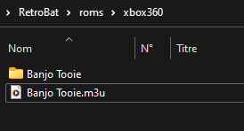

# Xbox 360


게임 콘솔 - 수명: 2005 - 2016


## 정 보

|||
|---|---|
| 에뮬레이터 | xenia-canary |
|  | xenia |
| 파일 폴더 | roms \ xbox360 |
| 파일 확장자 | .iso .xex .xcp .m3u |
|||


## 바이오스 정보

xenia / xenia-canary 에뮬레이터에서 Xbox 360 게임을 플레이하기 위한 특정 BIOS 요구 사항이 없습니다.


## 컨트롤

Xenia는 컨트롤의 수동 구성을 제공하지 않습니다.

Retrobat 시스템 옵션에서 사용할 컨트롤러 유형을 선택할 수 있습니다:
- Xbox 360 이후 모델용 Xbox 컨트롤러용 XBOX 컨트롤러
- 키보드용 키보드
- 기타 모든 유형의 컨트롤러(NINTENDO, DualShocks 등)의 경우 OTHER


## 특수 시스템 정보

### XBLA(Xbox Live Arcade) 게임 추가

Xbox360 XBLA 게임(XBox Live Arcade)은 확장자가 없는 파일로 끝나는 여러 폴더의 연속 형태로 제공됩니다.

예를 들어 Banjo Tooie 게임의 경우 파일 경로는 다음과 같습니다:

**\Banjo Tooie\58410955\000D0000\ABB9CAB336175357D09F2D922735D23C62F90DDD**

Retrobat가 게임을 실행할 수 있으려면 *.m3u 파일을 생성하여 \roms\xbox360 폴더의 루트에 배치해야 합니다.

  
<sup>Banjo Tooie의 예</sup>

The content of the .m3u file is the following:

```
\Banjo Tooie\58410955\000D0000\ABB9CAB336175357D09F2D922735D23C62F90DDD
```

> BATGUI tool offers an automatic m3u creation tool. Refer to the [BATGUI](https://wiki.retrobat.org/advanced-features/batgui) section of the wiki.