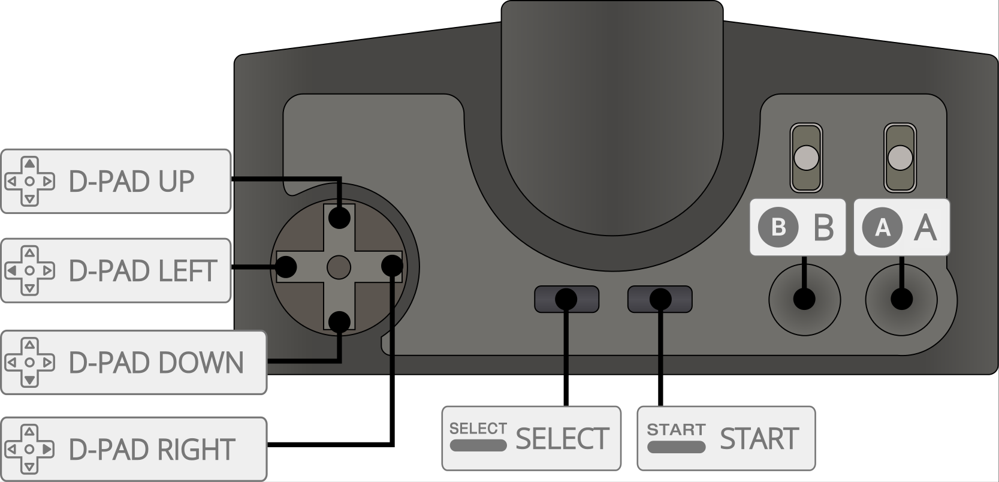

# PC Engine/TurborGrafx-16

게임 콘솔 - 수명: 1987 - 1994

## 정 보

|||
|---|---|
| 에뮬레이터 | Libretro: mednafen_pce |
|  | Libretro: mednafen_pce_fast |
|  | Libretro: fbneo |
| 파일 폴더 | roms \ pcengine |
| 파일 확장자 | .pce .bin .zip .7z .wad |
|||

## 바이오스 정보

| 바이오스 파일 | 폴더 | md5 |
|---|---|---|
| syscard3.pce | `\bios` | 38179df8f4ac870017db21ebcbf53114 |
|||

## 컨트롤

| Retrobat 버튼 | PC Engine 키 |
|---|---|
| START | START / RUN |
| SELECT | SELECT |
| D-PAD, 왼쪽 아날로그 스틱 | D-PAD |
|  |  |
|  | B / II |
|  | A / I |
|  |  |
| L1 |  |
| R1 |  |
|||

## 특정 시스템 정보

아직 여기에 문서화된 특정 시스템 정보가 없습니다.