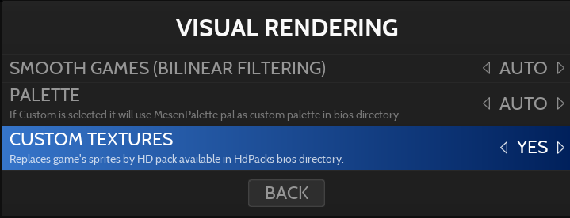

# Nintendo Entertainment System - Family Computer

게임 콘솔 - 수명: 1983 - 2003년

## 정 보

|||
|---|---|
| 에뮬레이터 | libretro: fceumm |
|  | libretro: nestopia |
|  | libretro: mesen |
|  | mednafen |
|  | mesen |
| 게임 경로 | roms \ nes |
| 파일 확장자 | .fds .nes .wad .zip .7z |
|||

## 특 징

| Retroachievements | 넷플레이 |
|---|---|
| 예 | 예 |
|||

## 바이오스

게임을 실행하는 데 필요한 BIOS 파일이 없습니다.

## 컨트롤

| RetroBat 키 | NES 키 |
|---|---|
| START | START |
| SELECT / BACK | SELECT |
| D-PAD | D-PAD |
| 왼쪽 아날로그 스틱 | D-PAD |
| 오른쪽 아날로그 스틱 |  |
|  | B |
|  | A |
|  | A |
|  | B |
|||

## 특정 시스템 정보

### 커스텀 텍스쳐

libretro:mesen 코어를 사용하면 사용자 지정 텍스처 팩을 로드할 수 있습니다.

그렇게 하려면 게임 파일과 이름이 같은 전용 디렉토리의 \bios\HdPacks 폴더에 사용자 지정 텍스처 팩을 배치해야 합니다. 예를 들어 게임 이름이 Mega Man (USA).nes인 경우 텍스처 팩 폴더 이름은 Mega Man(미국)이어야 합니다.

> 게임 파일의 sha1 해시가 텍스처 팩 폴더의 "hires.txt" 파일에 있는 sha1과 일치하는 것이 매우 중요합니다.

그런 다음 게임 또는 시스템용 Libretro: mesen 에뮬레이터를 선택합니다.

다음으로 게임 옵션 또는 고급 시스템 옵션의 고급 설정 > 시각적 렌더링 섹션에서 사용자 지정 텍스처 옵션을 활성화해야 합니다.

