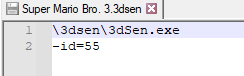
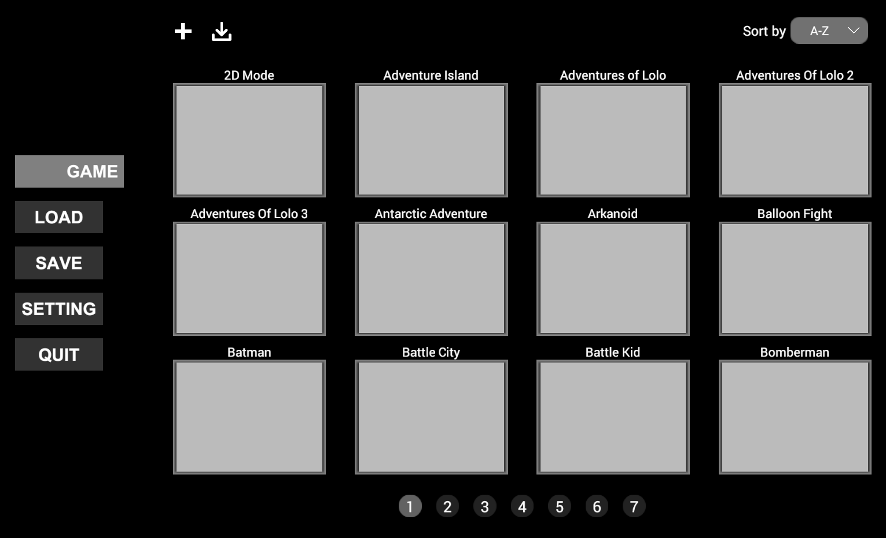
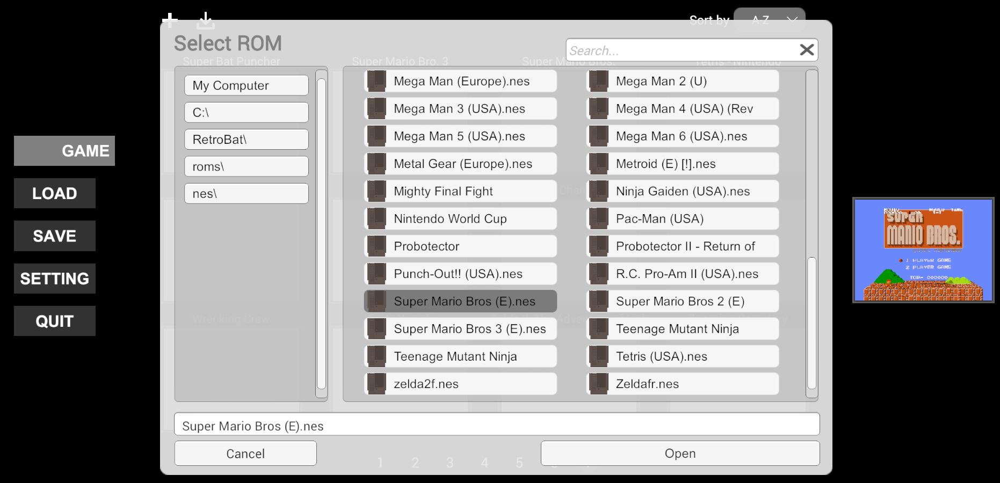

# NES 3D

> 3DSen은 유료 소프트웨어이며 Retrobat 팀에서 제공하지 않습니다.  
구입한 에뮬레이터는 \emulators\3dsen 폴더에 설치해야 합니다.

## 정 보

|||
|---|---|
| 에뮬레이터 | 3DSen |
| 파일 폴더 | roms \ nes3d |
| 파일 확장자 | .3dsen |
|||

## 특 징

| Retroachievements | 넷플레이 |
|---|---|
| 아니오 | 아니오 |
|||

## 바이오스 정보

NES 게임을 플레이하는 데 특정 BIOS가 필요하지 않습니다.

## 컨트롤

[NES 시스템](https://wiki.retrobat.org/systems-and-emulators/supported-game-systems/game-consoles/nintendo-game-consoles/nintendo-entertainment-system-family-computer#controls)과 동일한 컨트롤.

## 특정 시스템 정보

### 3DSen 롬 파일

> RetroBat 팀은 "NoIntro" 롬셋 ROM 이름을 기반으로 게임 ROM을 3DSen ID에 연결하는 미리 구성된 json 파일과 3DSen 파일의 전체 세트를 준비했습니다.

3DSen 에뮬레이터에는 각 호환 게임에 대한 고정 ID가 있습니다. Retrobat가 게임과 함께 3DSen을 실행할 수 있으려면 게임 ID를 .3dsen 파일에 지정해야 합니다:

또한 각 게임 ID를 3DSen Emulator에서 직접 NES 시스템 롬에 연결해야 합니다.

실제 NES ROM은 \roms\nes 폴더에 있습니다.

게임을 두 번 클릭하고 NES ROM을 선택합니다:

### 지원되는 게임

|||
|---|---|
| 1 | Arkanoid |
| 10 | Digdug |
| 11 | Donkey Kong |
| 12 | Donkey Kong 3 |
| 13 | Donkey Kong Jr |
| 14 | Dr Mario |
| 15 | Duck Hunt |
| 16 | Elevator Action |
| 17 | Excitebike |
| 18 | Galaga |
| 19 | Gyromite |
| 2 | Balloon Fight |
| 20 | Hogan's Alley |
| 21 | Ice Climber |
| 22 | Journey To Silius |
| 23 | Shadow Of Ninja / Kage |
| 24 | Kungfu / Spartan X |
| 25 | Legacy Of The Wizard |
| 26 | Legend Of Kage |
| 27 | Lode Runner |
| 28 | Mappy |
| 29 | Mario Bros. |
| 3 | Batman |
| 30 | Mega Man 1 |
| 31 | Mega Man 2 |
| 32 | Metroid |
| 33 | Pacman |
| 34 | Popeye |
| 35 | Road Fighter |
| 36 | Super Bat Puncher |
| 37 | Super Mario Bros. |
| 38 | Tetris - Nintendo |
| 39 | Tetris - Tengen |
| 4 | Battle Kid |
| 40 | Urban Champion |
| 41 | Wrecking Crew |
| 42 | Yie Ar Kungfu |
| 43 | Bubble Bobble |
| 44 | Wild Gun Man |
| 45 | Legend Of Zelda |
| 46 | Zooming Secretary |
| 47 | 2D Mode |
| 48 | City Connection |
| 49 | Micro Mages |
| 5 | Battle City |
| 50 | TwinBee |
| 51 | Pinball |
| 52 | Flappy Bird |
| 53 | Flappy Bird FPV |
| 54 | Shatterhand |
| 55 | Super Mario Bro. 3 |
| 56 | Goonies |
| 57 | Pooyan |
| 58 | Chip & Dale Rescue Ranger |
| 59 | Duck Tales |
| 6 | Bomberman |
| 60 | Adventures of Lolo |
| 61 | Antarctic Adventure |
| 62 | Clu Clu Land |
| 63 | Spy Hunter |
| 64 | Mega Man 3 |
| 65 | Ghosts N Goblins |
| 66 | Adventures Of Lolo 2 |
| 67 | Adventures Of Lolo 3 |
| 68 | Duck Tales 2 |
| 69 | Adventure Island |
| 7 | Castlevania |
| 70 | Snow Brothers |
| 71 | Jackie Chan's Action KungFu |
| 72 | Depths |
| 73 | Zelda II: The Adventure of Link |
| 74 | Castlevania II: Simon's Quest |
| 75 | Solomon's Key |
| 76 | Fire 'n Ice |
| 77 | Final Fantasy |
| 78 | Dragon Warrior I |
| 79 | Dragon Warrior II |
| 8 | Circus Charlie |
| 80 | Felix the Cat |
| 81 | Gradius |
| 82 | Burger Time |
| 83 | Life Force |
| 84 | Ninja Gaiden III |
| 9 | Contra |
