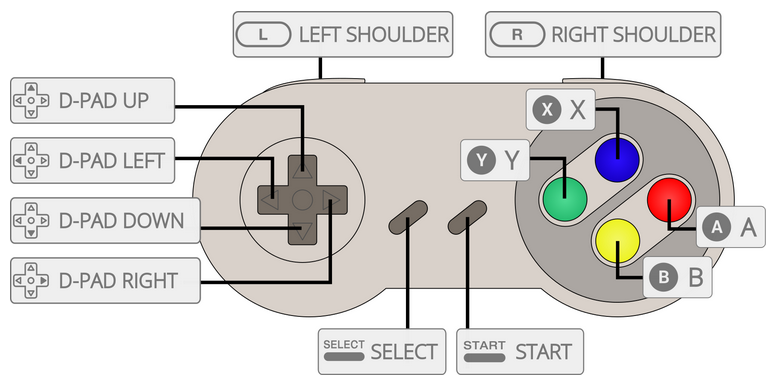

# Super Nintendo Entertainment System - Super Famicom
Nintendo

게임 콘솔 - 수명: 1990 - 2003

## 정보

|||
|---|---|
| 에뮬레이터 | libretro: snes9x |
|           | libretro: bsnes |
|           | libretro: bsnes_hd_beta |
|           | libretro: mednafen_snes |
|           | libretro: mesen-s |
|           | mednafen |
|           | snes9x |
| 게임 위치 | roms \ snes |
| 파일 확장자 | .smc .fig .sfc .gd3 .gd7 .dx2 .bsx .swc .rom .wad .zip .7z |
|||

## 특징

| Retroachievements | Netplay |
|---|---|
| Yes | Yes |
|||

## 바이오스

게임을 실행하는 데 필요한 BIOS 파일이 없습니다.

## 컨트롤

| RetroBat Key | Super Nintendo Key|
|---|---|
| START | START |
| SELECT / BACK | SELECT |
| D-PAD | D-PAD |
|  | B |
|  | A |
|  | X |
|  | Y |
| LB (L1) | L |
| RB (R1) | R |
|||

## Libretro 코어 컨트롤러 유형
### Player 1 controller types:
- Joypad
- Mouse (all except mednafen_snes)
- Multitap (snes9x only)

### Player 2 controller types:
- Joypad
- Mouse (all except mednafen_snes)
- Multitap (all except mednafen_snes)
- Superscope (all except mednafen_snes)
- Justifier (all except mednafen_snes and mesen-s)
- M.A.C.S. Rifle (snes9x only)

## 특정 시스템 정보
아직 여기에 문서화된 특정 시스템 정보가 없습니다.