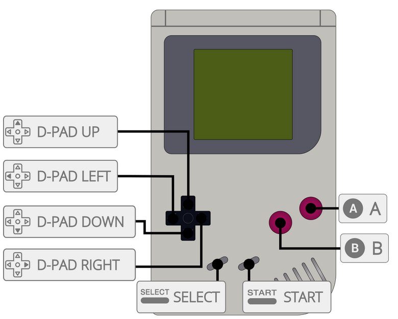

# Super Game Boy
Hori, Nintendo

게임 콘솔 액세서리 - 출시일: 1994년

## 정보

|||
|---|---|
| 에뮬레이터 | libretro: mgba |
|           | libretro: mesen-s |
|           | mgba |
| 게임 위치 | roms \ sgb |
| 파일 확장자 | .gb .gbc .zip .7z |
|||

## 바이오스

| BIOS 파일 | 폴더 | md5 |
|---|---|---|
| sgb_boot.bin | `\bios` | d574d4f9c12f305074798f54c091a8b4 |
| sgb2_boot.bin | `\bios` | e0430bca9925fb9882148fd2dc2418c1 |
| SGB1.sfc | `\bios` | b15ddb15721c657d82c5bab6db982ee9 |
| SG2.sfc | `\bios` | 8ecd73eb4edf7ed7e81aef1be80031d5 |
|||

## 컨트롤

Game Boy 시스템과 동일한 매핑

| RetroBat Key | SUper Game Boy Key |
|---|---|
| START | START |
| SELECT / BACK | SELECT |
| D-PAD | D-PAD |
| Left analog stick | D-PAD |
| Right analog stick | |
|  | B |
|  | A |
|  | |
|  | |
| L1 | |
| R1 | |
| L2 | |
| R2 | |
| L3 | |
| R3 | |
|||

## 특정 시스템 정보

아직 여기에 문서화된 특정 시스템 정보가 없습니다.