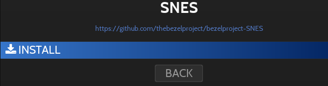

# 데코레이션 & 베젤
80~90년대 TV와 컴퓨터 화면은 대부분 4:3 이었습니다.
오늘날 16:9 형식 모니터에서 실행하면 양쪽에 빈 공간이 있을 것입니다.

게임의 좌우측 남은 공간은 **장식**(베젤)으로 채울 수 있습니다.

Retrobat는 3가지 유형의 장식을 제공합니다.
- 데코레이션
- 베젤 프로젝트
- 메가 베젤

## 데코레이션
표준 데코레이션은 왼쪽과 오른쪽 공간을 채우는 가장 간단한 방법입니다.

기본 메뉴(게임 설정 > 장식), 보기 옵션(고급 시스템 옵션 > 장식) 또는 게임 옵션(고급 게임 옵션 > 장식)에서 활성화할 수 있습니다.

다음 옵션을 사용할 수 있습니다

| 설정 | 주목 |
|:---:|:---:|
| AUTO | 콘솔이나 아케이드 기계 재현 |
| NONE | 데코레이션 없음 |
| AMBIANCE BROADCAST | |
| AMBIANCE GAMEROOM | |
| AMBIANCE MONITOR 1084S | |
| AMBIANCE NIGHT | |
| AMBIANCE VINTAGE TV | |
| ARCADE 1980S | |
| ARCADE 1980S VERTICAL | |
| ARCADE VERTICAL DEFAULT | |
| DEFAULT UNGLAZED | |
| THEBEZELPROJECT | 베젤 프로젝트 섹션을 참조하세요. |

다음은 Super Nintendo의 AUTO 설정 예입니다.

## 베젤 프로젝트
베젤 프로젝트는 게임 시스템별로 개인화된 베젤을 제공하며, 그 중 다수의 경우 게임당 맞춤형 베젤도 제공합니다.

### 베젤 다운로드
업데이트에서 베젤을 다운로드할 수 있습니다.

베젤 프로젝트(THE BEZEL PROJECT)를 선택하고 베젤을 다운로드하려는 시스템을 선택합니다.

 를 누르고 설치를 확인하세요.

다운로드가 시작됩니다

설치가 완료될 때까지 기다리세요

다운로드한 베젤은 `\decorations\thebezelproject\games` 폴더에 저장됩니다.

### 베젤 활성화
데코레이션 섹션을 참조하세요.
데코레이션 옵션을 THEBEZELPROJECT로 설정하세요.

The Bezel Project 데코레이션의 예:

> 게임별 베젤을 사용하려면 ROM 파일 이름이 `\decorations\thebezelproject\games` 폴더에 있는 베젤 이름과 정확히 동일해야 합니다.

### 메가 베젤
MegaBezel 팩은 셰이더와 베젤을 모두 결합하여 베젤에 동적 반사를 추가합니다.

> 메가 베젤은 Libretro 코어에서만 사용할 수 있으며 독립 실행형 에뮬레이터에서는 작동하지 않습니다.

#### MegaBezel 팩 다운로드
Content Downloader에서 Megabezels를 선택하세요.

팩은 `\emulators\retroarch\shaders` 폴더에 다운로드됩니다.

#### Enabling Mega Bezels
메가 베젤은 기본 메뉴(게임 설정 > 셰이더 세트), 보기 옵션(고급 시스템 옵션 > 셰이더 세트) 또는 게임 옵션(고급 게임 옵션 > 셰이더 세트)에서 활성화할 수 있습니다.

각 팩에는 다양한 옵션이 있습니다.

또한 **DECORATIONS**를 **NONE**으로 설정하고 **GAME ASPECT RATIO**를 **FULL**로 설정하세요.

> 4/3 화면을 사용하는 경우 **GAME ASPECT RATIO**를 "**AUTO**"로 둘 수 있습니다.

마지막으로 메가 베젤은 VULKAN 비디오 드라이버에서만 작동하므로 고급 설정 > 드라이버 메뉴에서 올바르게 설정되었는지 확인하세요.

다음은 메가 베젤의 몇 가지 예입니다.

## 메가 베젤 사용자 정의
"메가 베젤 사용자 정의" 섹션을 참조하십시오.