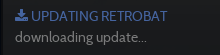
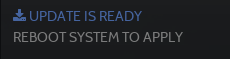
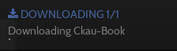

# 업데이트와 컨텐츠 다운로드

## 업데이트
Retrobat에는 자동 업데이트 시스템이 포함되어 있습니다.

새 버전이 출시되면 화면 상단에 아래와 같은 메시지가 나타납니다.

업데이트를 수행하려면 메인 메뉴를 열고 업데이트 & 다운로드를 선택하세요.

**START UPDATE**을 선택하세요

YES

업데이트 진행 상황은 오른쪽 상단에 표시됩니다.

업데이트가 완료되면 시스템을 재부팅하여 적용하세요.

Retrobat을 다시 시작하면 업데이트가 완료됩니다.

메인 메뉴 > 시스템 설정 > 정보에서 현재 버전 확인이 가능합니다.

## 다운로드
통합 콘텐츠 다운로더를 사용하면 무료로 배포되는 다양한 게임, 테마 및 추가 미디어를 설치할 수 있습니다.

다운로드 메뉴는 기본 메뉴에서 사용할 수 있습니다. 업데이트 & 다운로드로 이동하세요.

### 컨텐츠 다운로드
CONTENT DOWNLOADER를 선택하세요.

카테고리를 변경하려면 왼쪽과 오른쪽을 사용하고 목록을 탐색하고 설치할 콘텐츠를 선택하려면 위, 아래를 사용하세요.
설치하기 위해서를 누르세요.

메시지가 나타나고 컨텐츠가 올바른 폴더에 다운로드됩니다.

### 테마 다운로드

**테마 다운로더**에 액세스하려면 **테마**를 선택하세요.

설치하려는 테마로 이동한 후  를 눌러 설치하세요.

오른쪽 상단에 진행률 표시줄이 나타납니다.

다운로드가 완료되면 기본 메뉴의 사용자 인터페이스 설정에서 새 테마로 전환할 수 있습니다.

