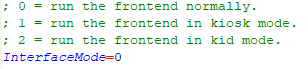

# 키오스크와 키드 모드

키오스크 모드와 키즈 모드는 메인 메뉴 > 시스템 설정 메뉴에서 활성화할 수 있습니다.

## 키오스크 모드

메인 메뉴가 제한되고 오디오 볼륨을 변경하는 항목만 표시됩니다.

게임 옵션 메뉴도 제한되어 메타데이터 편집기와 사용자 지정 게임 컬렉션을 수정하는 기능이 제거됩니다.

게임을 즐겨찾기로 표시하거나 표시 해제하는 기능이 제거됩니다.

모든 게임을 플레이할 수 있습니다.

## 키드 모드

어린이에게 적합하다고 표시된 게임만 표시됩니다(이 플래그는 메타데이터 편집기를 사용하여 게임별로 수동으로 설정됩니다).

게임 옵션 메뉴는 게임을 즐겨찾기로 표시하거나 표시 해제하는 기능과 마찬가지로 비활성화됩니다.

## 전체 모드로 돌아가기

다음 패드 문장을 입력하여 키오스크 또는 어린이 모드를 비활성화할 수 있습니다 : A A A B A

또는, `Retrobat` 폴더에 있는 `Retrobat.ini` 파일을 편집하고 "**InterfaceMode**" 값을 0으로 설정할 수 있습니다.:

