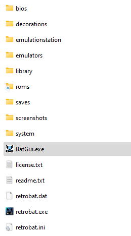

# Batgui

BatGui는 Retrobat와 함께 제공되는 소프트웨어이며 Retrobat 폴더의 루트에서 사용할 수 있습니다.

| Batgui.exe |
|:-:|

이 도구를 사용하면 다음을 수행할 수 있습니다.
- Retrobat.ini 구성 파일 관리
- 시스템 목록 관리
- 게임 목록 편집(게임 메타데이터 업데이트)
- Xbox360 및 PS3 에뮬레이터용 .m3u 파일 생성
- iso/cue 형식을 CHD 형식으로 변환
- SDL 라이브러리 버전 변경 및 컨트롤러 구성 재설정

## Retrobat ini

BatGui.exe를 사용하면 Retrobat.ini 파일의 설정을 편집할 수 있습니다.

## 시스템 목록

이 메뉴에서는 `es_systems.cfg` 파일을 업데이트할 수 있습니다. 예를 들어 시스템 확장을 제거할 수 있습니다.

## 게임목록 에디터

이 메뉴에서는 시스템의 `gamelist.xml` 파일을 업데이트할 수 있으며, 개별 게임의 메타데이터는 물론 게임 미디어도 여기에서 업데이트할 수 있습니다.

## M3U 크리에이터

이 메뉴에서는 에뮬레이터에 설치된 게임의 `\roms\ps3` 또는 `\roms\xbox360` 폴더에 .m3u 파일을 자동으로 생성할 수 있습니다.

## CHD 매니저

이 메뉴에서는 ISO/CUE ROM 형식을 CHD 형식을 지원하는 에뮬레이터용 CHD 형식으로 변환할 수 있습니다.

## SDL 라이브러리 버전 변경 및 컨트롤러 구성 재설정

"SDL Library Selector" 메뉴를 사용하면 컨트롤러 구성을 재설정할 수 있습니다. 이는 컨트롤러 구성 모듈에서 충돌이 발생할 경우 유용할 수 있습니다.
"게임패드 구성 재설정" 버튼을 클릭하기만 하면 모든 컨트롤러 구성이 삭제되고(키보드 제외) RetroBat이 컨트롤러를 다시 구성하라는 메시지를 표시합니다.
이 작업은 RetroBat 설치의 `emulationstation\.emulationstation` 폴더에 있는 **es_input.cfg** 파일을 다시 초기화합니다.

"SDL Library Selector" 메뉴에서는 다양한 SDL 버전 중에서 선택할 수도 있습니다. 이 옵션은 일부 컨트롤러가 최후의 수단 옵션으로 올바르게 인식되지 않는 경우 유용할 수 있습니다(항상 최신 버전부터 시작하고 가장 최근 버전부터 가장 오래된 버전까지 사용해 보세요).
이렇게 하려면 드롭다운 목록에서 DLL을 선택하고 "닫기"를 클릭하세요. 그런 다음 "GamePad 구성 재설정"을 클릭하십시오. 이제 RetroBat을 시작하고 컨트롤러를 재구성할 수 있습니다.

