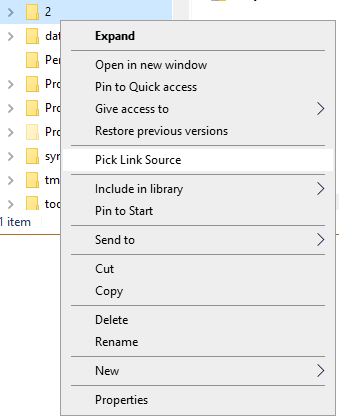
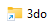

# 심볼릭 링크

게임을 다른 폴더에 저장하세요

기호 링크를 사용하는 것은 Windows에서 기본적으로 제공되는 솔루션으로, 논리 폴더를 컴퓨터의 다른 위치에 저장된 폴더로 지정할 수 있습니다.

Retrobat에서 이것이 어떻게 흥미로운가요?

이 기능의 요점은 표준 `\retrobat\roms\` 폴더가 아닌 다른 위치에 ROM을 물리적으로 저장할 수 있도록 하는 것입니다. 예를 들어 저장 크기가 더 큰 별도의 하드 드라이브에 저장할 수 있습니다.

|예제|
|:-:|


## 심볼릭 링크 생성

Windows에서 심볼릭 링크를 생성하려면 콘솔에서 명령줄을 사용하거나 "Link Shell Extension"이라는 도구를 사용할 수 있습니다. 다음에 설명하는 방법은 이 도구를 사용한 방법입니다.

### 링크 셸 확장 다운로드

프로그램은 [다음 웹사이트](https://schinagl.priv.at/nt/hardlinkshellext/linkshellextension.html#download)에서 다운로드할 수 있습니다.

### 링크 셸 확장 사용

설치가 완료되면 컴퓨터를 재부팅하거나 "explorer.exe" 프로세스를 닫고 다시 시작해야 합니다.

완료되면 마우스 오른쪽 버튼 클릭 상황에 맞는 메뉴에 새 옵션이 나타납니다.

| 링크 소스 선택 |
|:-:|


| 다음으로 삭제... |
|:-:|


### Link Shell Extension 사용 심볼릭 링크 생성

다음 예에서는 3do 게임 ROM을 `D:\Retrobat\3do`에 저장하고 Retrobat 설치 폴더는 `C:\Retrobat`라고 가정합니다.

1. 모든 ROM이 `D:\Retrobat\3do`에 제대로 복사되었는지, `C:\Retrobat\roms\3do`에 보관해야 할 중요한 데이터가 없는지 확인하세요.
2. `C:\Retrobat\roms\3do` 폴더 삭제
3. `D:\Retrobat\3do` 폴더를 마우스 오른쪽 버튼으로 클릭하고 "**링크 소스 선택**"을 선택합니다.
4. `C:\Retrobat\roms` 폴더로 이동하여 폴더 내부 아무 곳이나 마우스 오른쪽 버튼으로 클릭하고 "**다른 이름으로 놓기... > 심볼릭 링크**"를 선택합니다.
5. `C:\Retrobat\roms` 폴더에는 이제 작은 화살표가 있는 3do 폴더 아이콘  이 표시됩니다.

**축하합니다**: 방금 심볼릭 링크를 만들었습니다!

이제 다른 위치에 기본 폴더로 저장하려는 폴더에 대해 이 작업을 반복할 수 있습니다.

### 기본 Windows 명령으로 심볼릭 링크 만들기

이전과 동일한 예를 사용하여 Symlink 생성을 수동으로 수행해 보겠습니다.

1. 모든 ROM이 `D:\Retrobat\3do`에 제대로 복사되었는지, `C:\Retrobat\roms\3do`에 보관해야 할 중요한 데이터가 없는지 확인하세요.
2. `C:\Retrobat\roms\3do` 폴더 삭제
3. Windows 명령을 열고 다음 명령을 입력하십시오
 ```mklink /D "C:\Retrobat\roms\3do" "D:\Retrobat\3do```
4. `C:\Retrobat\roms` 폴더에는 이제 작은 화살표가 있는 3do 폴더 아이콘  이 표시됩니다.


