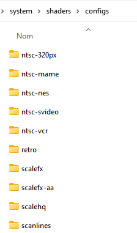
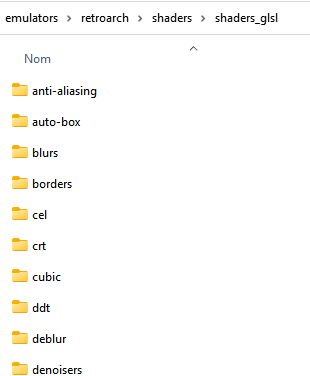
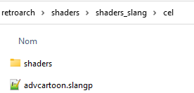
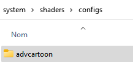
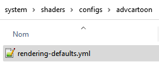
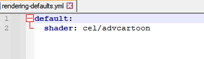

# RetroBat에 RetroArch 셰이더 세트 추가

Retrobat에는 셰이더 세트가 번들로 제공되지만 Retroarch에서 사용할 수 있는 모든 셰이더가 포함되어 있지는 않습니다.

libretro 코어의 Retrobat 메뉴에 새 셰이더 세트를 수동으로 추가할 수 있습니다. 절차는 다음과 같습니다.


## 셰이더의 위치

### Retrobat

Retrobat에서 사용 가능한 셰이더는 Retrobat 설치의 `\system\shaders\configs` 폴더에 있습니다.



### RetroArch

Retroarch에서 사용 가능한 셰이더는 Retrobat 설치의 `\retroarch\shaders\` 폴더에 있습니다.

먼저 셰이더 유형(glsl 또는 속어)별로 정렬됩니다.
- GLSL: OpenGL에서 사용할 수 있는 셰이더 형식입니다.
- Slang: 사용 가능한 경우 새로운 권장 셰이더 형식입니다. Vulkan, Direct3D 10/11/12, OpenGL Core와 호환됩니다.

> Retrobat는 시스템에 정의된 비디오 드라이버를 기반으로 올바른 폴더에서 자동으로 검색합니다.

| GLSL용 셰이더 폴더의 예 |
|:-:|


## Retrobat 메뉴에 새 셰이더 추가

Retrobat에 셰이더 "adv Cartoon"을 추가하려고 한다고 가정해 보겠습니다. 셰이더는 GLSL 및 SLANG 모두에 사용할 수 있습니다.

 | 
|---|---|

셰이더는 `\retroarch\shaders\shaders_xxxx\cel` 폴더에 있으며 이름은 "advphantoy.glslp"입니다.

Retrobat에 추가하려면 `\system\shaders\configs` 폴더로 이동하여 새 폴더를 만들고 이름을 "adv Cartoon"으로 지정합니다.



이 폴더 안에 "**rendering-defaults.yml**"이라는 파일을 만듭니다.



메모장으로 파일을 열고 다음 텍스트를 추가합니다.

```js
default:
  shader: <retroarch shader folder>/<shader filename without extension>
```

이 예에서는 다음과 같습니다.

```js
default:
  shader: cel/advcartoon
```



이제 셰이더 세트가 Retrobat에 나타납니다.

