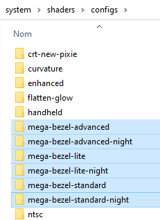

# 사용자 정의 메가 베젤

RetroBat을 사용하면 Duimon의 Mega-Bezel 팩을 다운로드할 수 있습니다
(자세한 내용은 Wiki의 데코레이션 & 베젤 섹션에서 찾을 수 있습니다).

이 페이지에서는 메가 베젤을 사용자 정의하는 방법을 보여주는 세부 정보와 한 가지 예를 제공합니다.

## 모든 필수 파일의 위치

먼저, 수정하려는 파일이 어디에 있는지 이해해야 합니다.

### RetroBat files

사용 가능한 메가 베젤 목록을 표시하기 위해 RetroBat 인터페이스에서 사용하는 파일은 RetroBat 설치의 `system\shaders\configs` 폴더에 있습니다.

각 하위 폴더에는 다음을 지정하는 `render-defaults.yml` 파일이 포함되어 있습니다.
- 해당 시스템
- 이 시스템에 적용되는 "사전 설정"입니다.

### Retroarch

Mega-Bezel을 활성화하기 위해 Retroarch에서 사용되는 파일은 RetroBat 설치의 `emulators\retroarch\shaders\Mega_Bezel_Packs\` 폴더에 저장됩니다.

## Retrobat에 새로운 Mega-Bezel 사전 설정 항목 추가

### Step 1 : 사전 설정 사용자 정의

이 튜토리얼에서 사용할 예에서는 베젤 이미지를 미러링하여 올바른 방향으로 나타나도록 Saturn 시스템에 새 사전 설정을 추가합니다
(일부 시스템에서는 기본 베젤이 뒤집어질 수 있음).

|Saturn을 위한 "미러링" 베젤의 예(오른쪽 상단 텍스트 참조)|
|:-:|

먼저 기존 사전 설정 파일을 복사하고 베젤을 미러링하는 명령을 추가하여 사용자 정의해 보겠습니다.
먼저 `emulators\retroarch\shaders\Mega_Bezel_Packs\Duimon-Mega-Bezel\` 폴더에 있는 기존 사전 설정을 복사해야 합니다.

SATURN 시스템에 가장 많이 사용되는 [Bezel] 및 [Bezel]-[Night](고급 버전)을 복사하겠습니다.

그런 다음 나중에 식별하는 데 도움이 되는 이름으로 사전 설정의 이름을 바꿉니다.

[VFlip] 태그(Vertical Flip으로)를 추가하고 이름에 공백이 추가되지 않았는지 확인합니다.

다음으로 텍스트 편집기로 두 파일을 모두 열고 이미지를 뒤집는 명령을 추가합니다.

`HSM_FLIP_VIEWPORT_VERTICAL = "1.000000"`

|이 라인은 효과를 올바르게 표시하기 위해 RetroArch에 제공되는 지침|
|:-:|

## RetroBat 메뉴에 새 사전 설정 추가

`system\shaders\configs` 폴더로 이동하여 기존 하위 폴더 중 하나(예: "mega-bezel-advanced-night")를 복사하고 새 폴더의 이름을 "mega-bezel-advanced-night-VFlip"으로 바꿉니다. RetroBat 메뉴에 표시될 이름

수정된 폴더 내에서 "rendering-defaults.yml"이라는 파일을 엽니다(RetroArch에 시스템에 사용할 사전 설정을 알려주는 파일입니다).

첫 번째 줄은 RetroBat에서 알려진 시스템에 해당합니다(`\emulationstation.emulationstation\es_systems.cfg` 파일에서 찾을 수 있는 공식 시스템 이름 사용).

두 번째 줄은 .slangp 파일을 가리켜 이 시스템에 사용할 사전 설정을 나타냅니다(여기에서는 상대 경로가 사용됨)

이 예에서는 수정한 사전 설정을 사용합니다(확장은 필요하지 않습니다).

파일을 저장하고 닫습니다.

RetroBat에서는 이제 셰이더 섹션에서 새로운 항목 "mega-bezel-advanced-night-vflip"을 사용할 수 있습니다.

이제 메가 베젤이 올바른 방식으로 표시됩니다.

더 많은 설정을 사용할 수 있으며 각 시스템에는 여러 사전 설정이 있습니다.
자세한 내용은 Duimon의 Github 페이지를 참조하세요: https://github.com/Duimon/Duimon-Mega-Bezel